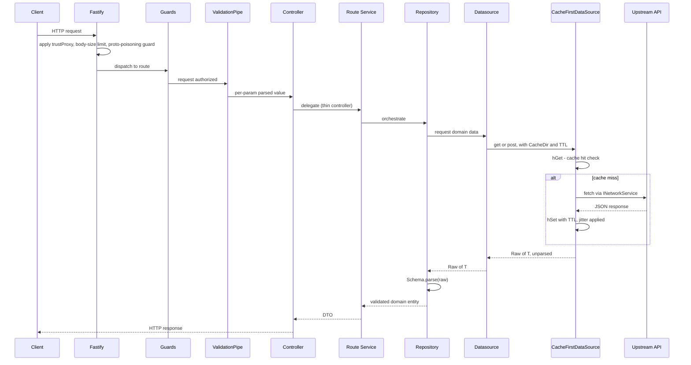
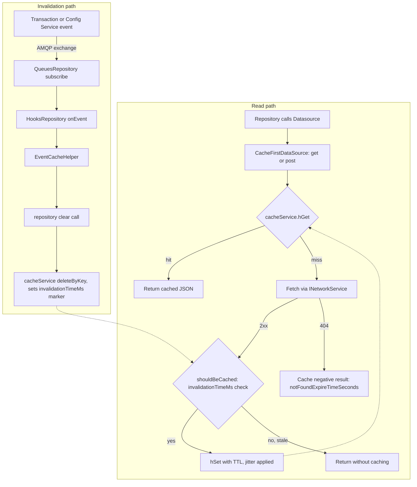

<!--
  SPDX-License-Identifier: FSL-1.1-MIT
 -->

# Architecture

Safe Client Gateway (CGW) is a caching, aggregating Backend-for-Frontend.
It bridges the Safe{Wallet} clients (Android, iOS, Web) to the Safe{Core} services (Transaction Service, Config Service, and others).
It reshapes their responses into client-oriented payloads, and shields clients from upstream latency and outages through caching.
CGW is a public repository.
Code committed from 2026-02-17 onward is licensed FSL-1.1-MIT (see `LICENSE`), while historical code up to 2026-02-16 remains MIT.

The mental model, end to end, is `Controller → Route Service → Repository → Datasource → CacheFirstDataSource → upstream API`.
Zod validation sits at both ends of that chain: once at the inbound HTTP boundary (per-parameter, via `ValidationPipe`), and once at the outbound boundary where a repository parses whatever a datasource returned before trusting it as a domain entity.
The sections below walk each link in that chain in turn, then the cross-cutting concerns — caching, persistence, async work, authentication, error handling, external services — that every module shares.

## Request lifecycle



Fastify is the HTTP platform (`src/app.provider.ts`).
`trustProxy` is read from configuration (`express.trustProxy` — a comma-separated subnet/preset list or a hop count), and the JSON body-size limit is parsed from `express.jsonLimit` (`parseBodyLimit`); the `express.*` config namespace predates the Fastify migration and is kept as-is.
The custom body parser preserves Fastify's default prototype-poisoning protection (`onProtoPoisoning`/`onConstructorPoisoning`) while restoring Express-compatible empty-body handling for requests with no payload.

Guards (`@UseGuards`) run next — see the guard inventory under AuthN/AuthZ below.
Each `@Param`/`@Query`/`@Body` argument is independently validated through a `ValidationPipe` (`src/validation/pipes/validation.pipe.ts`) wrapping a Zod schema; a failed parse throws `ZodErrorWithCode`, not a generic `BadRequestException`.
For example, `src/modules/balances/routes/balances.controller.ts` validates the `safeAddress` route param in place, as `@Param('safeAddress', new ValidationPipe(AddressSchema)) safeAddress: Address`, rather than trusting the raw string.
Controllers (`src/modules/*/routes/*.controller.ts`) are thin: they declare Swagger metadata and delegate straight to a route service, as `BalancesController.getBalances` does to `BalancesService.getBalances`.
The route service calls the module's repository (`src/modules/*/domain/`), which in turn calls a datasource.
Datasources return `Raw<T>` — compile-time-unusable, unvalidated data — and it is the repository that calls `Schema.parse()` to turn it into a trusted domain entity; `BalancesRepository` calling `BalancesSchema.parse(balances)` is one such instance.
Datasources that talk to an external API funnel their HTTP and caching through `CacheFirstDataSource` (`src/datasources/cache/cache.first.data.source.ts`), which is the only path to an upstream API for that data.

`src/main.ts` builds the Fastify adapter directly from raw configuration (`createFastifyAdapterFromConfiguration`), before the Nest DI container exists, because `trustProxy` and the body-size limit must be known at adapter-construction time.
Once the app is built, a fixed, ordered list of setup functions runs (`DEFAULT_CONFIGURATION` in `src/app.provider.ts`):

- API versioning is URI-based (`VersioningType.URI`), so a controller's `version` decorator maps to a `/v1/...`/`/v2/...` path segment.
- Swagger is generated and mounted at `/api`.
- Shutdown hooks are skipped in development so restarts stay fast.
- `@fastify/cookie` is registered — the mechanism the `access_token` cookie (see AuthN/AuthZ) depends on.

## Module anatomy

Every feature module under `src/modules/` follows this shape:

```
src/modules/<kebab-name>/
├── <kebab-name>.module.ts
├── domain/
│   ├── <name>.repository.ts
│   ├── <name>.repository.interface.ts
│   └── entities/            # Zod schemas + z.infer types (+ __tests__/ builders)
├── routes/                  # only if HTTP endpoints exist
│   ├── <name>.controller.ts
│   ├── <name>.service.ts
│   ├── entities/            # DTOs (Zod schema + @ApiProperty class)
│   └── v2/                  # versioned controllers when needed
└── datasources/             # only if the module owns an external API
    ├── <api>-api.service.ts
    └── entities/*.entity.db.ts
```

The one qualification to `routes/` is staged delivery: under a declared multi-PR series it may land one PR ahead of its controller — see the Canonical skeleton rule in `docs/agents/module-structure.md` for the conditions.

Layer responsibilities are fixed:

- **Controllers** are thin: routing, Swagger decorators, and pipe wiring only — no business logic.
- **Route services** (`routes/*.service.ts`) orchestrate: they combine one or more repository calls into the shape a client endpoint needs.
- **Repositories** (`domain/*.repository.ts`) validate and own domain logic: every value crossing the boundary from a datasource is parsed with a Zod schema before the repository returns it.
- **Datasources** (`datasources/*-api.service.ts`) fetch and cache: they own the HTTP call to one external API and the `CacheFirstDataSource` wiring around it.

Dependency injection uses a Symbol-per-interface pattern throughout.
`export const IFoo = Symbol('IFoo')` is declared next to `interface IFoo` in the same `*.interface.ts` file, and the owning module binds it with `{ provide: IFoo, useClass: Foo }` — e.g. `IBalancesRepository` in `src/modules/balances/domain/balances.repository.interface.ts`, bound in `src/modules/balances/balances.module.ts`.
Consumers inject the symbol and type against the interface, never the concrete class.

`routes/entities/` and `domain/entities/` hold two different things that can otherwise look alike.
A domain entity is a Zod schema plus its `z.infer` type, used internally.
A DTO pairs a Zod schema with a class decorated with `@ApiProperty` so Swagger can document the shape, and it is that class the controller declares as its response `type`.
`routes/v2/` (or a sibling `v2` module, e.g. `src/modules/chains/routes/v2/`) sits alongside an existing unversioned controller when a breaking response-shape change needs a new API version rather than an in-place change.
Test builders under `entities/__tests__/` are fluent (`.with(field, value)`, via the shared `Builder`/`IBuilder` in `src/__tests__/builder.ts`) and use `@faker-js/faker` for field values, so specs construct realistic entities instead of hard-coding literals.
Spec files are also named by the Vitest project they belong to: plain `*.spec.ts` is a unit test, `*.integration.spec.ts` needs real backing services (Postgres, Redis) and is excluded from the unit run, and `*.e2e-spec.ts` exercises the whole app.

The Symbol-per-interface convention has one notable exception worth knowing about: the central network module exports its DI token as `export const NetworkService = Symbol('INetworkService')` (`src/datasources/network/network.service.interface.ts`) rather than naming the constant `INetworkService` to match — the symbol's own string label still says `INetworkService`, only the exported binding name differs.

## Validation model

`Raw<T>` (`src/validation/entities/raw.entity.ts`) is a phantom type — `type Raw<_> = symbol` — that makes upstream data compile-time unusable until it is parsed: a function typed to take `T` rejects a `Raw<T>` even though at runtime it is the same value.
`rawify()` performs the one unchecked cast where a datasource hands raw JSON up to its repository.
The repo runs Zod 4 (see the `zod` entry in `package.json`); `ZodErrorFilter` (see Error handling) explicitly accounts for Zod 4's union-error shape when extracting the most relevant validation issue to report.

Zod is the source of truth for domain types: a schema is defined once and the TypeScript type is derived with `type X = z.infer<typeof XSchema>`, rather than the schema being hand-fitted to a pre-existing interface.
Persistence-side TypeORM entity classes (`*.entity.db.ts`) then `implements DomainX` against that same inferred type — e.g. `User implements DomainUser` in `src/modules/users/datasources/entities/users.entity.db.ts` — so a column added to the domain schema without a matching entity field fails to compile.

A shared schema library (`src/validation/entities/schemas/`) backs common primitives used across modules:

- `AddressSchema` — parses and checksums addresses via viem's `getAddress`, rejecting anything that fails checksum/format validation.
- `NumericStringSchema` — a base-10 numeric string, explicitly rejecting hex-looking values.
- `HexSchema` — a `0x`-prefixed hex string (viem's `isHex`).
- `UuidSchema` — validates a UUID and casts it to Node's `UUID` type.
- `RedirectUrlSchema` — bounds length (2048 chars) and rejects control characters; used to validate post-login redirect targets.

Paginated upstream responses share one factory, `buildPageSchema` (`src/domain/entities/schemas/page.schema.factory.ts`), which wraps an item schema in the `{ count, next, previous, results }` envelope.
A lenient variant, `buildLenientPageSchema`, drops individually-invalid items from `results` instead of failing the whole page — used where one malformed upstream record should not take down an entire listing endpoint.

## Caching



`CacheFirstDataSource` (`src/datasources/cache/cache.first.data.source.ts`) is the single hit/miss/write path used by every caching datasource: `hGet` the key, and on a miss, fetch from the network and `hSet` the JSON response with a TTL.
A response with HTTP 404 is cached too, but as a negative result, for `notFoundExpireTimeSeconds` (configured per-domain, e.g. `expirationTimeInSeconds.notFound.contract`/`.token` in `src/config/entities/configuration.ts`) — this stops a nonexistent contract or token from being re-requested upstream on every call.

A slow in-flight fetch can otherwise race an invalidation and write stale data back into the cache after the invalidation already ran.
`CacheFirstDataSource`'s private `_shouldBeCached` check guards against this: `deleteByKey` (`src/datasources/cache/redis.cache.service.ts`) both unlinks the key and stamps an `invalidationTimeMs:<key>` marker with the current time.
Before writing a freshly-fetched response, `_shouldBeCached` compares the fetch's start time against that marker and skips the write if the fetch started before the last invalidation.

Every cache entry is addressed by a `CacheDir` (`src/datasources/cache/entities/cache-dir.entity.ts`), a plain `{ key, field }` pair: `key` names the Redis hash (the resource, e.g. one Safe's balances) and `field` names the entry within it (the query-parameter variant, e.g. a `trusted`/`excludeSpam` combination).
`hGet`/`hSet` therefore operate on Redis hashes, not flat string keys, so every variant of a resource's cached responses lives under one Redis key.
Every cache key in the codebase is constructed through `CacheRouter` (`src/datasources/cache/cache.router.ts`) — there is no ad hoc key building elsewhere.
TTLs are never hard-coded at the call site; they come from `expirationTimeInSeconds.*` in `src/config/entities/configuration.ts` (e.g. `.default`, `.rpc`, `.staking`, `.zerionPositions`).
Every stored TTL is randomly deviated by `expirationTimeInSeconds.deviatePercent` (±10% by default) via `deviateRandomlyByPercentage` (`src/domain/common/utils/number.ts`), so identically-configured keys do not all expire at the same instant and stampede the upstream service.

Cache invalidation is event-driven.
The Transaction Service (and Config Service) publish events to an AMQP fanout exchange; CGW's `queues` module subscribes and hands each message to `HooksRepository` (`src/modules/hooks/domain/hooks.repository.ts`), which parses it against `EventSchema` and delegates to `EventCacheHelper` (`src/modules/hooks/domain/helpers/event-cache.helper.ts`).
`EventCacheHelper` maps each event type (`PENDING_MULTISIG_TRANSACTION`, `EXECUTED_MULTISIG_TRANSACTION`, `INCOMING_TOKEN`, `CHAIN_UPDATE`, and so on) to targeted deletes: the specific repository `clear*` calls that event affects, each of which ultimately calls `cacheService.deleteByKey`.
An executed multisig transaction, for example, clears the safe's collectibles, transfers, multisig transactions and Safe info in one pass.
A same-effect HTTP fallback exists at `POST /hooks/events` (`src/modules/hooks/routes/hooks.controller.ts`, guarded by `BasicAuthGuard`), gated by the `features.hookHttpPostEvent` flag.

## Persistence

Postgres is the system of record.
Schema changes are raw-SQL migrations under `migrations/`, run through the TypeORM migrator on startup; `synchronize` is always `false`, so there is no entity-driven auto-sync.
Postgres does not auto-index foreign-key columns, so an FK column shipped without an explicit index is a real failure mode here — `migrations/1777637000000-add-wallets-user-id-index.ts` is a backfill of exactly that.
The index rules, and the rest of this repo's migration conventions, live in `docs/agents/database-and-migrations.md`.

TypeORM entity classes live as `*.entity.db.ts` files under each module's `datasources/entities/` (e.g. `src/modules/users/datasources/entities/users.entity.db.ts`), and implement the corresponding domain type (`implements DomainUser`) rather than redeclaring its shape.
Entities meant to be persisted extend a common `RowSchema` (`src/datasources/db/v2/entities/row.entity.ts`), which fixes the `id`/`createdAt`/`updatedAt` columns as database-managed, not application-managed.

TypeORM's query cache is a separate Redis-backed cache from `CacheFirstDataSource` above (`db.orm.cache` in configuration, wired in `src/config/entities/postgres.config.ts`) and opt-in per query: a repository passes an explicit `cache: { id, milliseconds }` (e.g. `src/modules/notifications/domain/v2/notifications.repository.ts`), and that same repository is responsible for calling `connection.queryResultCache.remove([id])` on whichever write path invalidates it.
There is no automatic invalidation of ORM query-cache entries.

Database connection setup is deliberately explicit rather than implicit: `db.orm.manualInitialization` is `true`, so the app controls when the connection is established.
The migrations table name defaults to `_migrations` (`db.orm.migrationsTableName`), not TypeORM's own default.
Running migrations on startup is retried (`db.migrator.numberOfRetries`, default 5, waiting `db.migrator.retryAfterMs`, default 1000ms, between attempts) to tolerate Postgres not yet being reachable when the process starts.

## Async work

Background work runs on BullMQ queues backed by Redis, each declared with config-driven retry `attempts` and `backoff` (never hard-coded): csv-export (`src/modules/csv-export/v1/`), push notifications (`src/modules/notifications/domain/push/`), and SES email (`src/modules/email/ses/`).
Each queue has its own `@Processor`/`WorkerHost` consumer (e.g. `CsvExportConsumer` in `src/modules/csv-export/v1/consumers/csv-export.consumer.ts`) and its own `removeOnComplete`/`removeOnFail` retention config.
The BullMQ connection itself is registered once, globally, in `src/app.module.ts` (`BullModule.forRootAsync`, pointed at `redis.host`/`redis.port`) — individual queue modules register a named queue against that shared connection rather than opening their own.

Crons registered via `@nestjs/schedule`'s `@Cron` are conventionally declared with `disabled: process.env.NODE_ENV === 'test'` so they do not fire during a test run — e.g. `EventCacheHelper.logUnsupportedEvents`/`clearSupportedChainsMemo` in `src/modules/hooks/domain/helpers/event-cache.helper.ts`, and `clearSignatureMemo` in `src/domain/common/entities/safe-signature.ts`.
This is not yet applied everywhere: `CircuitBreakerService.cleanupStaleCircuits` (`src/datasources/circuit-breaker/circuit-breaker.service.ts`) runs unconditionally every 30 minutes.

The csv-export job streams end-to-end: an async generator pages through transactions, `CsvService` serializes them to CSV, and the result streams directly into an S3 multipart upload — the full export is never buffered in memory.
See `src/modules/csv-export/v1/csv-export.service.ts` for the full pipeline.

## AuthN/AuthZ

SIWE (Sign-In with Ethereum) is the primary wallet-based login (`src/modules/siwe/domain/siwe.repository.ts`): the server generates a single-use nonce (`generateSiweNonce`), stores it in cache, and deletes it the moment it is looked up for verification, so a nonce cannot be replayed regardless of whether the signature check that follows succeeds.
Nonce/message validity is additionally capped by `auth.clockSkewSeconds` and the SIWE message's own expiry.

A successful login sets a JWT in an `httpOnly` cookie named `access_token` (`ACCESS_TOKEN_COOKIE_NAME`, `src/modules/auth/utils/auth-cookie.utils.ts`); `secure` is always `true`, and `sameSite` is `lax` in production, `none` otherwise.
The signing algorithm is pinned to `HS256` (`JWT_HS_ALGORITHM`, `src/datasources/jwt/jwt.service.ts`) for both `sign` and `verify` — a token asserting any other algorithm is rejected.
OIDC login (Auth0) is a separate, feature-flagged path (`src/modules/auth/oidc/`) that verifies ID tokens against Auth0's JWKS endpoint via `createRemoteJWKSet`, with the key set cached and cooldown-limited per `auth.auth0.jwksCacheMaxAgeMs`/`jwksCooldownMs`.
Within it, `src/modules/auth/oidc/auth0/` keeps the same datasource/domain split as a feature module: a datasource (`auth0-api.service.ts`) calls Auth0's token endpoint, and a domain layer (`auth0.repository.ts`, `auth0-token.verifier.ts`) owns verification.
The post-login redirect target that flow ends on is itself Zod-validated with `RedirectUrlSchema` (`src/modules/auth/oidc/routes/oidc-auth.controller.ts`), then checked same-origin against `auth.allowedRedirectDomain` before falling back to the configured `auth.postLoginRedirectUri` (`src/modules/auth/utils/auth-redirect.helper.ts`).

`RateLimitGuard` (`src/routes/common/guards/rate-limit.guard.ts`) is a base class, not a singleton limiter: each call site subclasses it with its own `{ max, windowSeconds }`.
`OidcAuthRateLimitGuard` (`src/modules/auth/oidc/routes/guards/oidc-auth-rate-limit.guard.ts`) is one such subclass, configured from `auth.rateLimit.max`/`auth.rateLimit.windowSeconds`.
The `spaces` module defines its own, each with independent limits: `SpacesCreationRateLimitGuard`, `SpacesAddressBookRateLimitGuard`, and `SpacesAddressBookRequestsRateLimitGuard` (`src/modules/spaces/routes/guards/`, `src/modules/spaces/routes/address-books/guards/`).

Guard inventory:

| Guard | Protects | Mechanism |
| --- | --- | --- |
| `AuthGuard` / `OptionalAuthGuard` | User-facing routes | Verifies the `access_token` cookie JWT; the optional variant lets the request through when no cookie is present |
| `BasicAuthGuard` | Internal/service endpoints (e.g. `POST /hooks/events`) | A static shared credential compared against `Basic <token>` |
| `TenderlySignatureGuard` | Tenderly alert webhooks | HMAC-SHA256 over the request body and timestamp, compared with `crypto.timingSafeEqual` |
| `RateLimitGuard` subclasses (e.g. `OidcAuthRateLimitGuard`) | Any route they are applied to | Per-route/IP counter in the cache service, 429 once the configured window's max is exceeded |
| `CaptchaGuard` | Routes gated by `captcha.enabled` | Verifies a Cloudflare Turnstile token from the `x-captcha-token` header |

## Error handling

Each layer funnels exceptions through exactly one place.
Datasources normalize any thrown error with `HttpErrorFactory` (`src/datasources/errors/http-error-factory.ts`) into a `DataSourceError` (`src/domain/errors/data-source.error.ts`), which carries a message safe to expose and an optional HTTP status code (defaulting to 503).
`DataSourceErrorFilter` (`src/routes/common/filters/data-source-error.filter.ts`) is the only place that turns a `DataSourceError` into an HTTP response.
`HttpErrorFactory` reads the upstream message from the response body's `message` key, so an upstream reporting it under another key yields a generic `An error occurred`.
The Transaction Service's HTTP 451 for a banned Safe — returned by every Safe-scoped endpoint, with the reason under `detail` — is the one case handled explicitly: `mapBannedSafeError` (`src/datasources/errors/helpers/banned-safe.helper.ts`) rewrites that payload before the factory reads it, so the 451 reaches the client with a stable message rather than a generic one.
It is applied by the three datasources that call the Transaction Service (`TransactionApi`, `SafeBalancesApi`, `ExportApi`) rather than inside `HttpErrorFactory`, because 451 only carries that meaning for that upstream.

Validation failures funnel through `ZodErrorFilter` (`src/routes/common/filters/zod-error.filter.ts`), which distinguishes the two places a Zod error can originate.
A `ZodErrorWithCode` from a route-level `ValidationPipe` (user input) returns 422 with the parsed issue.
A bare `ZodError` from repository/domain-layer parsing (an upstream response failing its own schema) returns a generic 502, since its detail could leak internal shape.
`GlobalErrorFilter` (`src/routes/common/filters/global-error.filter.ts`) is the catch-all backstop for anything else: it logs server errors (5xx) and skips the log for anything thrown as `HttpExceptionNoLog` (`src/domain/common/errors/http-exception-no-log.error.ts`) — used for rejections that are expected/user-caused and would otherwise be noise.

All three filters are registered globally as `APP_FILTER`s in `src/app.module.ts`, catch-all first — the order is load-bearing because NestJS matches filters in reverse registration order, so the later-registered, type-specific `DataSourceErrorFilter` and `ZodErrorFilter` take precedence and `GlobalErrorFilter` handles only what they do not catch.
`MessageVerifierHelper` (`src/modules/messages/domain/helpers/message-verifier.helper.ts`) is a representative `HttpExceptionNoLog` thrower: a Safe message whose computed hash does not match the one the client asserted is a client-input problem, not an incident.

## External services

All outbound HTTP goes through `INetworkService` (`src/datasources/network/network.service.interface.ts`) — there is no direct `fetch`/HTTP client usage inside a datasource.
Requests default to a 5-second timeout (`httpClient.requestTimeout`) with no automatic retries.
A circuit breaker (`src/datasources/circuit-breaker/`) is opt-in per request via a `circuitBreaker.key`, and trips after `circuitBreaker.threshold` consecutive failures within `circuitBreaker.rollingWindow`.

Per-chain external APIs share a common shape: `IApiManager<T>` (`src/domain/interfaces/api.manager.interface.ts`) declares `getApi(chainId)`/`destroyApi(chainId)`, and is implemented once per API family — `IBalancesApiManager`, `ITransactionApiManager`, `IStakingApiManager`, `IBlockchainApiManager`, and others.
The rest of the codebase asks its manager for "the client for this chain" rather than juggling per-chain client instances itself.

| Service | Role in this repo |
| --- | --- |
| Safe Transaction Service | Per-chain source of Safe/transaction/balance data, via `ITransactionApi` (`src/domain/interfaces/transaction-api.interface.ts`) |
| Safe Config Service | Chain metadata, feature flags, Safe Apps registry (`src/datasources/config-api/config-api.service.ts`) |
| Coingecko | Fiat prices for native coins and tokens; requests are batched and chunked (`src/modules/balances/datasources/coingecko-api.service.ts`) |
| Zerion | Wallet/Safe positions and portfolio data (`src/modules/zerion/`, `src/modules/positions/`) |
| Blockaid | Address and transaction threat analysis (`src/modules/safe-shield/threat-analysis/blockaid`) |
| Tenderly | Transaction simulation and alert webhooks, HMAC-verified (`src/modules/alerts/`) |
| AWS KMS | Field-level encryption and asymmetric signing (`src/datasources/kms/`) |
| AWS S3 | CSV export and targeted-messaging file storage (`src/datasources/storage/`) |
| AWS SES / Pushwoosh | Transactional and marketing email (`src/modules/email/ses/`, `src/modules/email/pushwoosh/`) |
| Cloudflare Turnstile | Captcha verification (`src/routes/captcha/`) |
| Fingerprint | Device/geo signal for Safe token locking eligibility (`src/datasources/locking-api/fingerprint-api.service.ts`) |

## Legacy trees (frozen)

Three trees predate the current per-module layout.
New feature code does not land in them.

- `src/routes/` — only `common/` is live: shared HTTP infrastructure (guards, filters, pagination helpers, decorators) imported across most of `src/modules/`. `src/routes/captcha/` is a feature that has not yet been migrated into `src/modules/`.
- `src/domain/` — cross-cutting shared domain code plus `src/domain/interfaces/`, which holds the datasource interface contracts: the `Symbol`-DI seam for datasources that are still central rather than module-owned.
- `src/datasources/` — cross-cutting infrastructure every module can depend on: cache, db, network, jwt, kms, job-queue, storage, circuit-breaker. It also still hosts API clients that have not been migrated into their owning module's `datasources/`: `billing-api`, `config-api`, `etherscan-api`, `fee-service-api`, `locking-api`, `push-notifications-api`.

"Frozen" describes where new code goes, not a ban on touching these trees: a bug fix to `src/routes/common/guards/rate-limit.guard.ts` still lands in `src/routes/common/`, because that is where the bug lives.
What does not happen is a new feature module, or a new per-chain API client, being added under `src/routes/`, `src/domain/`, or directly in `src/datasources/` — those go in `src/modules/<kebab-name>/`, following the Module anatomy shape above.
The contrast is visible today: `balances` (a migrated module) owns its price client at `src/modules/balances/datasources/coingecko-api.service.ts`, whereas `etherscan-api` — consumed by the `chains` module for gas-price data — remains central under `src/datasources/etherscan-api/` because no owning module has absorbed it yet.
The Symbol-DI pattern is identical either way; the split is about file location and ownership, not about how a dependency is wired.

See `docs/agents/module-structure.md` for the per-module structure guide.
