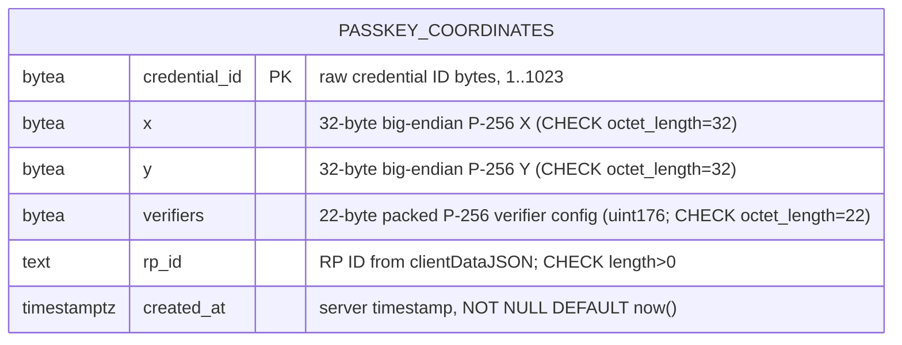

---

## title: 'feat: Passkey Coordinate Storage API'
type: feat
date: 2026-05-05
rfc: [https://www.notion.so/safe-global/RFC-Passkey-Coordinate-Storage-API-3508180fe57381c4b470ef25097fc2ab](https://www.notion.so/safe-global/RFC-Passkey-Coordinate-Storage-API-3508180fe57381c4b470ef25097fc2ab)
linear_project: Passkey Signer — Device-Bound Signing Track (WA-2111)
tickets:
  - WA-2113 — passkey_coordinates migration
  - WA-2114 — scaffold module + feature flag + RP-ID allowlist
  - WA-2115 — POST /v1/passkeys + attestation verification
  - WA-2116 — GET /v1/passkeys/{credentialId}
  - WA-2117 — per-IP rate limits
  - WA-2118 — OpenAPI/Swagger docs
  - WA-2119 — e2e tests

# Passkey Coordinate Storage API

Implement a CGW-hosted API that maps a WebAuthn `credentialId` to its P-256 public-key coordinates `(x, y)` plus the `P256.Verifiers` configuration (a packed `uint176` identifying the precompile + software-fallback verifier the signer commits to at deploy time), so a synced passkey on a second device can be used as a Safe signer.

## Enhancement Summary

**Deepened on:** 2026-05-05
**Research agents used:** best-practices-researcher (WebAuthn / `@simplewebauthn/server`), framework-docs-researcher (NestJS + TypeORM + `bytea`), security-sentinel, data-integrity-guardian, architecture-strategist, performance-oracle, code-simplicity-reviewer, pattern-recognition-specialist, spec-flow-analyzer, silent-failure-hunter.

### Key decisions baked into the plan

1. `**signer_address` dropped from v1** (RFC author confirmed 2026-05-05). The CREATE2-derived analytics column is removed entirely — no `signer_address`, no `factory_init_code_hash`, no `key_type` discriminator. The API is now purely WebAuthn-attestation in → `(credentialId, x, y, verifiers, rpId)` out, with no Safe-contract coupling. Analytics, if needed later, is served via an offline derivation in the data warehouse from `(x, y, verifiers)` plus the published `@safe-global/safe-modules-deployments` factory metadata. See "Adding `signer_address` later" at the bottom of this section for the additive migration path.
2. **Codebase-convention alignment** — feature flag at `features.passkeys` (`FF_PASSKEYS`), DTOs at `routes/entities/*.dto.entity.ts`, entity at `datasources/entities/`, controller→service→repository layering, guards `PasskeysRegistrationRateLimitGuard` / `PasskeysLookupRateLimitGuard`.
3. **DB self-defence** — every column `NOT NULL`, `CHECK (octet_length(...))` on every fixed-width `bytea`, `credential_id` length bounded to `[1, 1023]` per WebAuthn L3, `FILLFACTOR=100` (insert-only workload).
4. `**@simplewebauthn/server` `^13` specifics** — pinned shape (`registrationInfo.credential.publicKey`), bundled `decodeCredentialPublicKey` helper, `supportedAlgorithmIDs: [-7]`, deterministic stateless `expectedChallenge` callback, `expectedOrigin` mandatory + allowlist.
5. **Silent-failure boundaries** — explicit exception → status mapping (parse → 400, `{verified:false}` → 422, unknown → 500 with errorId), startup assertion that allowlists are non-empty when feature is on, `ON CONFLICT` pattern that reliably distinguishes 201/200/409.
6. **DoS / abuse surface** — 24 KiB per-route body cap (sized to realistic worst-case attestation, not framework default), 500ms verification timeout, `PASSKEYS_VERIFIERS_ALLOWLIST` to prevent unbounded write-spam with attacker-chosen verifiers, trust-proxy / XFF verification for per-IP rate keying.
7. **HTTP cache headers** — `Cache-Control: public, max-age=86400, s-maxage=2592000, immutable` + `ETag` on 200; `no-store` on 4xx/429.
8. **Phase consolidation** — 7 Linear tickets retained 1:1, but groupable into 3 PRs.

### Adding `signer_address` later (additive, low-risk)

If a future need arises:

```sql
-- One forward-only migration:
ALTER TABLE passkey_coordinates ADD COLUMN signer_address bytea;
-- Backfill (one-shot job, run after deploy):
UPDATE passkey_coordinates
   SET signer_address = compute_create2(x, y, verifiers, <factory>, <init_code_hash>);
ALTER TABLE passkey_coordinates
  ALTER COLUMN signer_address SET NOT NULL,
  ADD CONSTRAINT signer_address_len CHECK (octet_length(signer_address) = 20);
CREATE INDEX "IDX_PC_signer_address" ON passkey_coordinates (signer_address);
```

Rows are immutable, so the backfill is order-independent and safe to retry. Determining factory address + init-code hash at backfill time decouples this from any chain-config plumbing CGW happens to have when the need arises. Even simpler alternative: ship the column derivation as a dbt model in the analytics warehouse and never touch the CGW DB.

## Overview

WebAuthn only emits the public key once (at credential creation, in the attestation). iCloud / Google Password Manager sync the private key across devices but never re-emit `(x, y)`. Without `(x, y)` we cannot derive the deterministic CREATE2 address of the `SafeWebAuthnSignerFactory` proxy, so the synced passkey on a second device cannot identify or sign for the Safe it owns. CGW becomes the offchain source of truth for `(credentialId → x, y, verifiers)`.

Two endpoints, one Postgres table, no auth coupling. The API is unaware of users; coordinates are public-key material.

## Problem Statement

- A user creates a passkey on their iPhone and adds it as a Safe signer (CREATE2 salt = `keccak256(x ‖ y ‖ verifiers)`).
- On their iPad, the synced credential produces an assertion but exposes only `credentialId` — no key.
- P-256 signatures do not allow public-key recovery (unlike secp256k1).
- Result: the second device cannot derive the signer address and cannot sign.
- Auth0's Management API was evaluated and rejected (5 hops, synthetic emailed users, unverifiable `userHandle`). The `largeBlob` extension was the original plan but iOS does not sync it.

## Proposed Solution

A small, self-contained NestJS module under [src/modules/passkeys/](src/modules/passkeys/) following the same shape as the existing [src/modules/spaces/](src/modules/spaces/) module. The module:

- Owns one Postgres table (`passkey_coordinates`).
- Exposes `POST /v1/passkeys` (write, attestation-verified) and `GET /v1/passkeys/{credentialId}` (public read).
- Is registered conditionally in [src/app.module.ts](src/app.module.ts) behind `FF_PASSKEYS`.
- Reuses CGW's existing `RateLimitGuard` ([src/routes/common/guards/rate-limit.guard.ts](src/routes/common/guards/rate-limit.guard.ts)) for per-IP rate limiting, mirroring [SpacesCreationRateLimitGuard](src/modules/spaces/routes/guards/spaces-creation-rate-limit.guard.ts).
- Verifies WebAuthn attestations with `@simplewebauthn/server` (new dependency).

## Technical Approach

### Architecture

```
src/modules/passkeys/
├── passkeys.module.ts                                   # module wiring + DI tokens
├── datasources/
│   └── entities/
│       └── passkey-coordinates.entity.db.ts             # TypeORM entity (matches src/modules/spaces/datasources/entities/space.entity.db.ts)
├── domain/
│   ├── passkeys.repository.interface.ts                 # IPasskeysRepository (DI token)
│   ├── passkeys.repository.ts                           # Postgres impl via PostgresDatabaseService
│   └── passkey-attestation.service.ts                   # @simplewebauthn/server wrapper, COSE → (x,y); generic — no passkey-domain types in signature
└── routes/
    ├── passkeys.controller.ts                           # POST + GET, Swagger decorators
    ├── passkeys.service.ts                              # HTTP orchestration (mirrors spaces.service.ts) — between controller and domain
    ├── passkeys.controller.spec.ts                      # unit/integration
    ├── passkeys.controller.e2e-spec.ts                  # e2e
    ├── entities/
    │   ├── register-passkey.dto.entity.ts               # POST request DTO (matches existing *.dto.entity.ts pattern)
    │   └── passkey-record.dto.entity.ts                 # GET response DTO
    └── guards/
        ├── passkeys-registration-rate-limit.guard.ts    # mirrors SpacesCreationRateLimitGuard naming
        └── passkeys-lookup-rate-limit.guard.ts
```

Patterns mirror Spaces (verified against codebase):

- **Layering**: controller → service (`passkeys.service.ts`) → repository / domain services. Spaces controllers depend only on services ([src/modules/spaces/routes/spaces.controller.ts:52](src/modules/spaces/routes/spaces.controller.ts#L52)).
- **Repository**: constructor-injected `PostgresDatabaseService` with lazy `getRepository(Entity)` ([src/modules/spaces/domain/spaces.repository.ts:32-60](src/modules/spaces/domain/spaces.repository.ts#L32-L60)).
- **Entity location**: `datasources/entities/*.entity.db.ts` — matches [src/modules/spaces/datasources/entities/space.entity.db.ts](src/modules/spaces/datasources/entities/space.entity.db.ts).
- **DTO location**: `routes/entities/*.dto.entity.ts` — matches existing convention (e.g. `create-space.dto.entity.ts`).
- **Module registration**: conditional spread in [src/app.module.ts](src/app.module.ts) under `features.passkeys` (the codebase flat `features:` namespace, not a per-module `featureEnabled` field).
- **Rate-limit guards**: subclass `RateLimitGuard` and call `super()` with config-read limits — same shape as [spaces-creation-rate-limit.guard.ts:15-32](src/modules/spaces/routes/guards/spaces-creation-rate-limit.guard.ts#L15-L32). Two guards because read/write budgets differ; consolidating into one parameterised guard is not worth the divergence from the established Spaces precedent.

### Module-boundary choices recorded for the future

- `**passkey-attestation.service.ts` stays generic** (input: bytes; output: `{ x, y, rpId, alg }`). No passkey-domain types in its signature, so a future move into a shared `webauthn` module is mechanical if WebAuthn ever gets reused for session auth or signed user actions.
- **Schema namespace isolation**: although the table lives in the CGW DB, the migration uses table prefix `passkey_` so a future extraction to a standalone service is a copy-paste, not a schema rewrite. The plan documents the extraction trigger explicitly: split out only if row count > 50M or non-WebAuthn credential types are added.
- **No Safe-contract coupling in v1**: dropping `signer_address` (RFC author confirmed) means the module has zero dependency on `SafeWebAuthnSignerFactory` addresses, init-code hashes, chainId, or `@safe-global/safe-modules-deployments`. The API is pure WebAuthn-attestation in → coordinates out. If `signer_address` is later judged worth carrying, the additive migration described in the Enhancement Summary is straightforward.

### Data Model

ERD (single new table, no FKs to existing tables):




- All columns `NOT NULL`. `created_at` defaults to `now()`.
- Rows are immutable by design — no `updated_at`, no `DELETE` endpoint (RFC §4.3, §4.4).
- `FILLFACTOR=100` on table — workload is insert-only and rows are immutable, so dead-tuple bloat is structurally impossible and packing pages tight maximises cache density.
- Estimated row size ~120 bytes; ~1.2 GB at 10M passkeys. No partitioning, no TTL.
- No secondary indexes — the only query shape is by primary keveriy (`credential_id`).

**DB-level invariants (in the migration's `up`)**:

```sql
CHECK (octet_length(x) = 32),
CHECK (octet_length(y) = 32),
CHECK (octet_length(verifiers) = 22),                   -- P256.Verifiers is uint176 = 22 bytes
CHECK (octet_length(credential_id) BETWEEN 1 AND 1023),
CHECK (rp_id <> '' AND length(rp_id) <= 253)            -- DNS label cap
```

**Immutability enforcement**: prefer `REVOKE UPDATE, DELETE ON passkey_coordinates FROM <app_role>` over a trigger — lighter and self-explanatory. If CGW does not separate app vs migration roles, fall back to a `BEFORE UPDATE OR DELETE` trigger that raises unless an explicit `current_setting('app.allow_passkey_mutation', true) = 'on'` is set inside any backfill scripts.

**Down-migration**: a plain `DROP TABLE passkey_coordinates` is destructive — once any user has registered a passkey, dropping the table strands their second-device recovery permanently. The migration file must carry a prominent comment: *"Down migration is destructive: registered passkeys cannot be recovered. Do not run in production once `FF_PASSKEYS=true`. Backup `passkey_coordinates` before reverting."* The down step also `RAISE NOTICE`s the row count it is about to drop.

### Encoding (wire vs storage)


| Domain   | Field                                                 | Wire format                                             | At rest         |
| -------- | ----------------------------------------------------- | ------------------------------------------------------- | --------------- |
| WebAuthn | `credentialId`, `attestationObject`, `clientDataJSON` | base64url (no padding)                                  | raw `bytea`     |
| Ethereum | `x`, `y`                                              | `0x`-prefixed lowercase 64-char hex                     | raw `bytea(32)` |
| Safe-passkey | `verifiers`                                       | `0x`-prefixed lowercase 44-char hex (22 bytes; opaque packed value, not an address) | raw `bytea`, length 22 |
| Generic  | `createdAt`                                           | RFC 3339 / ISO 8601 (UTC)                               | `timestamptz`   |


Server normalizes input (lowercase hex, strip/add `0x`, validate base64url charset) before persisting — single canonical byte sequence is the source of truth.

### Implementation Phases

The 7 Linear tickets map cleanly onto a dependency-ordered build. Each phase ends in a mergeable PR.

#### Phase 1 — Foundation: Schema migration ([WA-2113](https://linear.app/safe-global/issue/WA-2113))

- New migration `migrations/<timestamp>-create-passkey-coordinates.ts` following existing convention (e.g. [migrations/1777636800000-create-counterfactual-safe-users.ts](migrations/1777636800000-create-counterfactual-safe-users.ts)). Timestamp must be greater than the latest existing migration.
- **Up**:
  ```sql
  CREATE TABLE passkey_coordinates (
    credential_id  bytea       NOT NULL PRIMARY KEY,
    x              bytea       NOT NULL,
    y              bytea       NOT NULL,
    verifiers      bytea       NOT NULL,
    rp_id          text        NOT NULL,
    created_at     timestamptz NOT NULL DEFAULT now(),
    CHECK (octet_length(x) = 32),
    CHECK (octet_length(y) = 32),
    CHECK (octet_length(verifiers) = 22),                   -- P256.Verifiers is uint176 (packed precompile + FCL fallback)
    CHECK (octet_length(credential_id) BETWEEN 1 AND 1023),
    CHECK (rp_id <> '' AND length(rp_id) <= 253)
  ) WITH (FILLFACTOR = 100);

  -- Optional but preferred: revoke UPDATE/DELETE on the app role
  -- (uncomment when CGW separates app vs migration roles)
  -- REVOKE UPDATE, DELETE ON passkey_coordinates FROM <cgw_app_role>;
  ```
- **Down**: `DROP TABLE passkey_coordinates;` — preceded by `RAISE NOTICE 'Dropping % rows', (SELECT count(*) FROM passkey_coordinates);` and a header comment marking the migration as destructive.
- No secondary indexes (only PK lookup is needed). No triggers (immutable rows, no `updated_at`). No `CREATE INDEX CONCURRENTLY` — none needed.

**Acceptance**:

- `yarn build` and existing CGW test suite pass.
- Migration is reversible against a clean DB (CI runs `up` then `down` then `up`).
- All `CHECK` constraints enforced (verified by attempting an insert that violates each, expecting `23514` SQL state).
- Down-migration carries the destructive-rollback warning comment.

#### Phase 2 — Module skeleton + config + feature flag ([WA-2114](https://linear.app/safe-global/issue/WA-2114))

- Create directory layout listed under "Architecture".
- Empty `controller`, `service`, `repository`, `module` — no endpoint logic yet.

**Configuration (codebase convention: feature flags live under flat `features:`, tunables under per-module top-level keys):**

```ts
// src/config/entities/configuration.ts (extend existing default())

features: {
  // ...existing flags...
  passkeys: process.env.FF_PASSKEYS?.toLowerCase() === 'true',
},
passkeys: {
  rpIdAllowlist: (process.env.PASSKEYS_RP_ID_ALLOWLIST ?? 'app.safe.global,safe.global')
    .split(',').map((s) => s.trim()).filter(Boolean),
  // Origin allowlist — required by W3C WebAuthn L3 §7.1 step 9 and by
  // @simplewebauthn/server (`expectedOrigin` is mandatory). RP-ID alone is spoofable
  // outside browser contexts.
  originAllowlist: (process.env.PASSKEYS_ORIGIN_ALLOWLIST ?? 'https://app.safe.global')
    .split(',').map((s) => s.trim()).filter(Boolean),
  // P256.Verifiers allowlist — known-valid uint176 packed values (precompile-addr
  // upper 2 bytes ‖ FCL-fallback-addr lower 20 bytes). NOT Ethereum addresses.
  // Bounded set per the contracts team. Prevents unbounded spam-write with
  // attacker-chosen verifier configurations (see Trust & Threat Model).
  // Format on input: `0x`-prefixed 44-char lowercase hex; comma-separated.
  verifiersAllowlist: (process.env.PASSKEYS_VERIFIERS_ALLOWLIST ?? '')
    .split(',').map((s) => s.trim().toLowerCase()).filter(Boolean),
  rateLimit: {
    registration: {
      max: parseInt(process.env.PASSKEYS_REGISTRATION_RATE_LIMIT_MAX ?? '20'),
      windowSeconds: 600,  // hardcoded; per-window-seconds knobs aren't realistically tuned
    },
    lookup: {
      max: parseInt(process.env.PASSKEYS_LOOKUP_RATE_LIMIT_MAX ?? '120'),
      windowSeconds: 600,
    },
  },
  // Hard cap on verifier wall-clock; protects worker thread from cert-chain stalls
  verificationTimeoutMs: 500,
},
```

**Conditional registration in [src/app.module.ts](src/app.module.ts)** (mirrors existing `isUsersFeatureEnabled` pattern at [src/app.module.ts:80,114](src/app.module.ts#L80)):

```ts
const { passkeys: isPasskeysFeatureEnabled } = configFactory().features;
// ...
...(isPasskeysFeatureEnabled ? [PasskeysModule] : []),
```

**Startup safety assertion** — in `PasskeysModule`'s `OnModuleInit`:

```ts
if (rpIdAllowlist.length === 0)
  throw new Error('PASSKEYS_RP_ID_ALLOWLIST must be non-empty when FF_PASSKEYS=true');
if (originAllowlist.length === 0)
  throw new Error('PASSKEYS_ORIGIN_ALLOWLIST must be non-empty when FF_PASSKEYS=true');
if (verifiersAllowlist.length === 0)
  throw new Error('PASSKEYS_VERIFIERS_ALLOWLIST must be non-empty when FF_PASSKEYS=true');
```

This prevents a "fail-open via empty allowlist" regression if a future refactor introduces "skip check when allowlist empty" semantics.

**Acceptance**:

- Module compiles, lints, registers behind flag.
- Config keys appear in `configuration.ts` with sensible defaults and are validated.
- Unit test verifies endpoints return 404 when `FF_PASSKEYS=false` (module not registered).
- Unit test verifies module bootstrap throws when any of the three allowlists is empty AND `FF_PASSKEYS=true`.
- Naming: `FF_PASSKEYS` matches existing `FF_USERS`/`FF_AUTH` convention.

#### Phase 3 — POST /v1/passkeys with attestation verification ([WA-2115](https://linear.app/safe-global/issue/WA-2115))

This is the substantive ticket.

**1. DTO + validation** — `register-passkey.dto.entity.ts`:

```ts
export class RegisterPasskeyDto {
  @IsString() @MaxLength(253) @Matches(/^[A-Za-z0-9.-]+$/)
  rpId!: string;

  // 16 KiB caps the encoded attestation at ~1.5x the realistic worst case
  // (TPM with cert chain, ~10 KB encoded). `none`/`packed`/`apple` are <2 KB.
  @IsString() @Matches(/^[A-Za-z0-9_-]+$/) @MinLength(1) @MaxLength(16 * 1024)
  attestationObject!: string;     // base64url

  // clientDataJSON is always small: {type, challenge, origin, [topOrigin], [crossOrigin]}.
  // 2 KiB is generous; real values are 200-400 B.
  @IsString() @Matches(/^[A-Za-z0-9_-]+$/) @MinLength(1) @MaxLength(2 * 1024)
  clientDataJSON!: string;        // base64url

  @IsString() @Matches(/^0x[0-9a-fA-F]{44}$/)
  verifiers!: string;             // P256.Verifiers (uint176, 22 bytes) — packed precompile + FCL fallback addresses, NOT an Ethereum address

  // Origin the WebAuthn ceremony ran in (from clientDataJSON.origin); MUST be
  // bound by the client and MUST appear in PASSKEYS_ORIGIN_ALLOWLIST. Required
  // by `@simplewebauthn/server`'s `expectedOrigin`. URL hostnames are short.
  @IsString() @MaxLength(512)
  origin!: string;

  // Stateless replay protection: client MUST set this to a server-recomputable
  // value (e.g. keccak256 of the (rpId, x_placeholder, y_placeholder, verifiers)
  // tuple, or a known constant per the RFC's Cometh-style stateless model).
  // The server verifies it via a deterministic callback — never just `() => true`.
  // 256 B is generous — typical is base64url(SHA-256(...)) = 88 B.
  @IsString() @Matches(/^[A-Za-z0-9_-]+$/) @MaxLength(256)
  challenge!: string;
}
```

Note: **no** `x`/`y` field. The server NEVER trusts coordinates from the client; they come exclusively from the verified attestation. The DTO enforces this at the type level.

**2. Body-size cap** — register the controller with `bodyParser.json({ limit: '24kb' })` scoped to `/v1/passkeys` only (CGW's global default is laxer). The 24 KiB ceiling = sum of field caps (~19 KiB) + JSON envelope slack. Realistic real-world POSTs are 1-3 KiB; TPM worst case is ~11 KiB. Anything beyond 24 KiB is malformed or hostile. The body cap is the cheap first line of defence (parsed before DTO validation), bounding CBOR-bomb DoS surface that the rate limit alone wouldn't stop — a single malformed payload can pin a worker for seconds.

Add an e2e that posts a 1 MB body and asserts `413 Payload Too Large`. Add a second e2e that posts a 32 KiB body (just over the cap) and also asserts 413 — verifies the cap is actually tight and not the framework default.

**3. Attestation service** — `passkey-attestation.service.ts` wraps `@simplewebauthn/server`'s `verifyRegistrationResponse`. Pin to `^13` (latest stable is 13.3 as of 2026; v11 was the last breaking-API change — `AuthenticatorDevice` → `WebAuthnCredential` rename and `registrationInfo` restructure — and v12/v13 are functionally compatible with the v11 shape).

```ts
const verification = await verifyRegistrationResponse({
  response: {
    id: dto.credentialId,            // base64url, derived from attestationObject for verification
    rawId: dto.credentialId,
    response: { attestationObject: dto.attestationObject, clientDataJSON: dto.clientDataJSON },
    type: 'public-key',
    clientExtensionResults: {},
  },
  expectedChallenge: async (clientChallenge) => {
    // Deterministic stateless challenge, recomputed server-side from request inputs.
    // Constant-time compare. Never `() => true` — that strips replay protection.
    const expected = computeExpectedChallenge(dto);
    return timingSafeEqualB64(clientChallenge, expected);
  },
  expectedOrigin: passkeysConfig.originAllowlist,   // mandatory; supports string[]
  expectedRPID: passkeysConfig.rpIdAllowlist,        // never undefined — silently skips check
  requireUserPresence: true,
  requireUserVerification: false,                    // synced credentials may not assert UV
  supportedAlgorithmIDs: [-7],                       // ES256 only — refuse RS256/EdDSA
});
if (!verification.verified) throw new UnprocessableEntityException();

const { credential, fmt, rpID, origin } = verification.registrationInfo!;
const cose = decodeCredentialPublicKey(credential.publicKey);
if (cose.get(COSEKEYS.kty) !== 2 /* EC2 */) throw new BadRequestException('not EC2');
if (cose.get(COSEKEYS.alg) !== -7) throw new BadRequestException('alg not ES256');
if (cose.get(COSEKEYS.crv) !== 1) throw new BadRequestException('crv not P-256');
const x = pad32(cose.get(COSEKEYS.x) as Uint8Array);
const y = pad32(cose.get(COSEKEYS.y) as Uint8Array);
```

`pad32` left-pads to 32 bytes and rejects > 32 — defends against authenticators that elide leading zeros (RFC 8812 says they shouldn't, but defensive RP code does this anyway).

The whole call is wrapped in a 500ms timeout (`AbortController` or `Promise.race` with `setTimeout`); on timeout, throw a custom error mapped to `503 Service Unavailable` with errorId `PASSKEY_VERIFICATION_TIMEOUT`. This protects the worker thread from cert-chain stalls in `tpm`/`android-safetynet`.

**4. Exception → status mapping** — explicit, no `try { verify } catch {}`. Mapping table:


| Cause                                       | Library behavior                                           | HTTP status  | errorId                         |
| ------------------------------------------- | ---------------------------------------------------------- | ------------ | ------------------------------- |
| Missing/empty/non-base64url field in DTO    | DTO `class-validator` rejects before service               | 400          | (Nest default)                  |
| `clientDataJSON.type !== 'webauthn.create'` | Service throws `BadRequestException`                       | 400          | `PASSKEY_NOT_CREATE_TYPE`       |
| `rpId` not in `rpIdAllowlist`               | Service throws `ForbiddenException` before calling library | 403          | `PASSKEY_RPID_NOT_ALLOWED`      |
| `origin` not in `originAllowlist`           | Service throws `ForbiddenException`                        | 403          | `PASSKEY_ORIGIN_NOT_ALLOWED`    |
| `verifiers` not in `verifiersAllowlist`     | Service throws `ForbiddenException`                        | 403          | `PASSKEY_VERIFIERS_NOT_ALLOWED` |
| CBOR / COSE / base64 parse error            | `verifyRegistrationResponse` throws `SyntaxError`/similar  | 400          | `PASSKEY_MALFORMED_ATTESTATION` |
| Unsupported alg / non-EC2 / non-P-256       | Library throws OR our post-check throws                    | 400          | `PASSKEY_UNSUPPORTED_KEY`       |
| `rpIdHash` mismatch in `authData`           | Library throws                                             | 400          | `PASSKEY_RPID_MISMATCH`         |
| Attestation signature fails                 | Library returns `{ verified: false }`                      | 422          | `PASSKEY_ATTESTATION_INVALID`   |
| Verification timed out                      | Custom timeout wrapper                                     | 503          | `PASSKEY_VERIFICATION_TIMEOUT`  |
| Existing row, same `credentialId`, different `(x, y)` or `verifiers` | Repository                                | 409          | `PASSKEY_CONFLICT`              |
| Existing row, same `(credentialId, x, y, verifiers)` but different `rpId` | Repository                           | 409          | `PASSKEY_CROSS_RP_CONFLICT`     |
| Existing row, identical `(credentialId, x, y, verifiers, rpId)` | Repository                                     | 200          | (success)                       |
| Inserted                                    | Repository                                                 | 201          | (success)                       |
| Anything else                               | Unhandled                                                  | 500 (logged) | `PASSKEY_INTERNAL_ERROR`        |


**Critically**: error response bodies must NOT include the library's stack trace or COSE-field-name in the message — that is an oracle for crafting valid-looking attestations. Use the opaque `{ code: errorId, message: '...' }` envelope already established in CGW.

**5. Idempotent first-write-wins (race-safe)** — single-roundtrip on success:

```ts
const inserted = await repo.createQueryBuilder()
  .insert()
  .values(record)
  .orIgnore()                  // ON CONFLICT (credential_id) DO NOTHING
  .returning('*')
  .execute();

if (inserted.raw.length === 1) return { status: 201, body: serialize(inserted.raw[0]) };

// PK conflict — re-select to distinguish 200 (identical) from 409 (mismatch)
const existing = await repo.findOneByOrFail({ credentialId: record.credentialId });
return bytesEqual(existing.x, record.x)
    && bytesEqual(existing.y, record.y)
    && bytesEqual(existing.verifiers, record.verifiers)
    && existing.rpId === record.rpId         // RP-scoped per WebAuthn — must also match
  ? { status: 200, body: serialize(existing) }
  : { status: 409 };
```

`save()` after `findOne()` has a TOCTOU window — rejected. Concurrent insert race is covered by the unique-PK guarantee + `orIgnore`. `**rpId` is part of the conflict tuple** (gap-fix surfaced by spec-flow analysis): WebAuthn `credentialId`s are RP-scoped, so two registrations of the same `credentialId` under different RP IDs is anomalous and gets a 409 with `PASSKEY_CROSS_RP_CONFLICT` errorId.

**6. New dependencies**:

- `@simplewebauthn/server` — pinned at `^13` (current latest is 13.3 as of 2026). Use the bundled `@simplewebauthn/server/helpers` (`decodeCredentialPublicKey`, `COSEKEYS`, `isoBase64URL`) — no separate CBOR library required.
- No `viem` / `ethers` needed in this module. `verifiers` is `uint176` (22 bytes), not an Ethereum address — there is no EIP-55 checksum to compute. All hex rendering on the wire is plain `'0x' + buf.toString('hex')`.

`Buffer.from(s, 'base64url')` is standard in Node ≥16; no encoding library needed.

**Acceptance**:

- DTO rejects malformed input at the controller pipe (no service entry).
- Service-level unit tests for each row of the status-mapping table above.
- COSE parsing tested with real attestation fixtures committed under `src/modules/passkeys/__tests__/fixtures/` covering at minimum `none` + `packed` (covers iOS / Android / hardware keys); accept narrower coverage on exotic `fmt` values.
- Server NEVER trusts `(x, y)` from request body — DTO has no such field; verified by reviewing the merged DTO definition.
- 500ms timeout fires on a slow/stalled cert-chain fixture (e.g. malformed `tpm`).
- Body-size limit returns 413 on a 1 MB POST.
- Error responses contain `{ code: errorId }` and never leak library internals.
- `PASSKEYS_VERIFIERS_ALLOWLIST` is enforced; an attestation with an unlisted `verifiers` returns 403, not 201.
- No reference to `signer_address`, `factory_init_code_hash`, `key_type`, factory address, init-code hash, or chainId anywhere in the module — verified by grep.

#### Phase 4 — GET /v1/passkeys/{credentialId} ([WA-2116](https://linear.app/safe-global/issue/WA-2116))

- Public, no auth. Rate-limited (Phase 5).
- Path param: URL-encoded base64url. Validate charset against `/^[A-Za-z0-9_-]{1,1366}$/` (ceil(1023 * 4 / 3) = 1364, rounded up). Decode → bytes → primary-key lookup.
- Response shape (RFC §4.1): `credentialId` (base64url), `x`, `y` (`0x`-hex 64-char), `verifiers` (`0x`-hex 44-char), `rpId`, `createdAt`.
- `404 Not Found` on miss; `400 Bad Request` on malformed `credentialId`.

**HTTP cache headers** — rows are immutable and keyed by an unforgeable `credentialId`, so edge-caching at any APISIX/CDN layer is correctness-safe and dramatically reduces DB load. But: we MUST avoid both stale-negative cache (a 404 cached just before the matching POST lands would lock first-launch flows for the TTL) and any cache-key oracle that a CDN's `X-Cache: HIT/MISS` header could leak.


| Status    | `Cache-Control`                                      | Other                                                                  |
| --------- | ---------------------------------------------------- | ---------------------------------------------------------------------- |
| 200       | `public, max-age=86400, s-maxage=2592000, immutable` | `ETag: "<hex(credential_id_first_16_bytes)>"`, `Vary: Accept-Encoding` |
| 400 / 404 | `no-store`                                           | (no ETag)                                                              |
| 429       | `no-store`                                           | `Retry-After: <seconds>`                                               |


`s-maxage=2592000` (30d) at the CDN, `max-age=86400` (1d) at the browser, `immutable` skips revalidation entirely. Eliminates ~90% of read load at steady state.

**Read-your-write**: single Postgres primary (no replicas in CGW today) — strong read-after-write consistency. Documented here so a future read-replica introduction triggers a re-evaluation.

**Acceptance**:

- Endpoint registered only when `FF_PASSKEYS=true`.
- Unit + integration tests for hit, miss, malformed input.
- Round-trip integration test: bytes written via `POST` are recoverable byte-identically via `GET`.
- e2e asserts `Cache-Control` headers per the table above on each status.

#### Phase 5 — Rate limiting ([WA-2117](https://linear.app/safe-global/issue/WA-2117))

- Two guards subclassing [RateLimitGuard](src/routes/common/guards/rate-limit.guard.ts), mirroring [SpacesCreationRateLimitGuard](src/modules/spaces/routes/guards/spaces-creation-rate-limit.guard.ts):
  - `PasskeysLookupRateLimitGuard` — defaults `120 / 600s`, env: `PASSKEYS_LOOKUP_RATE_LIMIT_MAX` (window hardcoded at 600s).
  - `PasskeysRegistrationRateLimitGuard` — defaults `20 / 600s`, env: `PASSKEYS_REGISTRATION_RATE_LIMIT_MAX` (window hardcoded at 600s).
- Attached via `@UseGuards(...)` on the relevant controller methods.
- Hits are logged through the existing `LogType.RateLimit` channel.
- Asymmetric budget (read >> write) is deliberate per RFC §4.6 — reads are first-launch-only on a new device; writes are already gated by attestation verification.

**Per-IP keying behind a CDN/proxy** — must verify the IP source. If `RateLimitGuard` reads `req.ip` and Nest is not configured with `trust proxy`, every request appears to originate from the CDN egress IPs and the rate limit becomes effectively global. Phase 5 acceptance includes:

- Confirming `app.set('trust proxy', ...)` is configured in [src/main.ts](src/main.ts) (or via Nest's `NestExpressApplication` bootstrap) to read the right-most untrusted hop of `X-Forwarded-For`.
- An e2e test that sends two requests with different spoofed `X-Forwarded-For` values and asserts independent rate-limit budgets.

**Redis-down behavior** — `RateLimitGuard` calls `cacheService.increment` without try/catch, so a Redis outage today fails closed (every request → 500). That is the security-correct default but observability is poor. Phase 5 adds:

- A `try/catch` around `increment` that emits a distinct log line via `loggingService.error({ type: LogType.RateLimit, errorId: 'RATE_LIMIT_BACKEND_UNAVAILABLE', ... })` before re-throwing.
- A unit test simulating a `cacheService.increment` rejection to assert the errorId fires.

`**credentialId` in logs** — to avoid stable-identifier-tracking concerns (combined with IP these are GDPR-relevant), log only `sha256(credential_id).slice(0, 8)` instead of the raw value in rate-limit and access logs. Add a small helper in `passkeys.service.ts`.

**Acceptance**:

- Two guards committed (`PasskeysRegistrationRateLimitGuard`, `PasskeysLookupRateLimitGuard`).
- Config keys added with defaults and validation.
- e2e test confirms `429 Too Many Requests` when budget is exceeded (both endpoints).
- e2e test confirms per-IP isolation via spoofed `X-Forwarded-For`.
- Redis-outage test asserts `RATE_LIMIT_BACKEND_UNAVAILABLE` errorId is logged.
- Hits logged via `LogType.RateLimit` with truncated-hash `credentialId`.
- 429 responses carry `Retry-After` and `Cache-Control: no-store`.

#### Phase 6 — OpenAPI / Swagger documentation ([WA-2118](https://linear.app/safe-global/issue/WA-2118))

- Add `@ApiTags('passkeys')`, `@ApiOperation`, `@ApiBody`, `@ApiOkResponse`, `@ApiCreatedResponse` (POST 201), `@ApiBadRequestResponse`, `@ApiForbiddenResponse`, `@ApiConflictResponse`, `@ApiUnprocessableEntityResponse`, `@ApiTooManyRequestsResponse`, `@ApiNotFoundResponse`, `@ApiServiceUnavailableResponse` (verification timeout) per endpoint — same convention as [spaces.controller.ts:48-85](src/modules/spaces/routes/spaces.controller.ts#L48-L85).
- **Note on 200 vs 201**: existing CGW controllers use `@ApiOkResponse` even on POST creates. We deviate intentionally here because the RFC explicitly mandates the `201` (created) vs `200` (idempotent re-POST) distinction (RFC §4.1) — clients use this signal to decide whether to display "already registered". Apply `@HttpCode(HttpStatus.CREATED)` and document the deviation in the controller's class-level comment.
- DTOs annotated with `@ApiProperty` describing encoding (base64url for WebAuthn fields, `0x`-prefixed lowercase hex for byte fields including `verifiers`, RFC 3339 for timestamps).
- Document the error envelope: `{ code: errorId, message: string }` with the full errorId list from Phase 3's mapping table as a Swagger `oneOf`.
- Surface in `specs/` if CGW publishes specs there.

**Acceptance**:

- Swagger UI renders both endpoints with example payloads.
- OpenAPI spec validates against the OAS 3.0 schema.
- Generated TypeScript types (if CGW emits them) compile downstream.
- All status codes from Phase 3's mapping table are documented with their errorId examples.
- Encoding contract (base64url / `0x`-hex / RFC 3339) is described in the schema, not just prose.

#### Phase 7 — End-to-end tests ([WA-2119](https://linear.app/safe-global/issue/WA-2119))

Co-located `passkeys.controller.e2e-spec.ts` next to the controller, following [src/modules/spaces/routes/spaces.controller.e2e-spec.ts](src/modules/spaces/routes/spaces.controller.e2e-spec.ts). Real attestation fixtures committed under `src/modules/passkeys/__tests__/fixtures/` covering at minimum `none` + `packed` `fmt` values (covers iOS, Android, hardware keys).

**Scenarios** (extends WA-2119 with gaps surfaced in spec-flow analysis):

Happy / idempotency:

- Happy path POST → 201; subsequent GET returns identical coords byte-for-byte.
- Idempotent re-POST (same payload) → 200, no duplicate row.
- Round-trip: bytes written via POST are recoverable byte-identically via GET.
- Concurrent POST race for same `credentialId` → exactly one 201, others 200 (no unique-violation 500).

Conflict cases:

- Same `credentialId`, different `(x, y)` or `verifiers` → 409 with `PASSKEY_CONFLICT`.
- Same `credentialId, x, y, verifiers` but **different `rpId`** → 409 with `PASSKEY_CROSS_RP_CONFLICT` (gap from spec-flow).

Rejection cases:

- `rpId` outside allowlist → 403 with `PASSKEY_RPID_NOT_ALLOWED`.
- `origin` outside allowlist → 403 with `PASSKEY_ORIGIN_NOT_ALLOWED`.
- `verifiers` outside allowlist → 403 with `PASSKEY_VERIFIERS_NOT_ALLOWED`.
- `clientDataJSON.type === 'webauthn.get'` (assertion not creation) → 400 with `PASSKEY_NOT_CREATE_TYPE`.
- Mixed-case `verifiers` input → accepted, persisted as canonical bytes, returned as `0x`-prefixed lowercase hex (case-insensitive on input; no checksumming since it's not an address).
- Tampered `attestationObject` → 422 with `PASSKEY_ATTESTATION_INVALID`.
- Malformed input (bad base64url, unsupported COSE alg) → 400.
- POST without `x`/`y` field — DTO has none, so this is enforced at the type level; no runtime test needed.

Bounds / DoS:

- POST with 1 MB body → 413.
- POST with 32 KiB body (just over the 24 KiB cap) → 413 — verifies the cap is actually tight, not the framework default.
- POST with attestation that triggers 500ms+ verification (slow cert chain fixture) → 503 with `PASSKEY_VERIFICATION_TIMEOUT`.
- `credentialId` length 0 or > 1023 bytes (decoded) → 400.

Read path:

- GET unknown `credentialId` → 404 with `Cache-Control: no-store`.
- GET malformed path → 400.
- GET hit → `Cache-Control: public, max-age=86400, s-maxage=2592000, immutable` + `ETag`.

Rate limiting:

- Read budget exceeded → 429 with `Retry-After` and `Cache-Control: no-store`.
- Write budget exceeded → 429.
- Per-IP isolation: requests with different `X-Forwarded-For` have independent budgets.
- 404-burst counts toward read budget (enumeration mitigation).

Feature flag:

- `FF_PASSKEYS=false` → all endpoints return 404 / module not registered.
- Empty `PASSKEYS_RP_ID_ALLOWLIST` with `FF_PASSKEYS=true` → app fails to bootstrap.

**Acceptance**:

- Tests run in CI alongside the existing CGW e2e suite.
- Fixtures recorded once and committed (no live WebAuthn ceremony in CI).
- All status codes in Phase 3's mapping table have at least one e2e scenario.

### PR mapping (independent of Linear ticket count)

The 7 phases group into 3 mergeable PRs to reduce review churn while preserving 1:1 ticket traceability:


| PR  | Phases (Linear tickets)                   | Rationale                                                                                                                                                          |
| --- | ----------------------------------------- | ------------------------------------------------------------------------------------------------------------------------------------------------------------------ |
| 1   | Phase 1, 2, 4 (WA-2113, WA-2114, WA-2116) | Migration + module skeleton + read endpoint — read path is small and self-contained, lands first behind the flag                                                   |
| 2   | Phase 3, 5, 6 (WA-2115, WA-2117, WA-2118) | Write endpoint + rate limits + Swagger — these are tightly coupled (rate-limit guards attach to the controller, Swagger annotates the DTO that Phase 3 introduces) |
| 3   | Phase 7 (WA-2119)                         | e2e fixtures and scenarios — runs against the merged feature, easier to author when both endpoints exist                                                           |


Linear tickets stay separate for tracking; PRs reference them in their description. PRs do not have to mirror tickets 1:1.

## Trust & Threat Model (extends RFC §4.7)


| Threat                                                                                                                 | Mitigation                                                                                                                                                                            | Where enforced                      |
| ---------------------------------------------------------------------------------------------------------------------- | ------------------------------------------------------------------------------------------------------------------------------------------------------------------------------------- | ----------------------------------- |
| Client lies about `(x, y)`                                                                                             | Server re-derives from attestation; DTO has no `x`/`y` field                                                                                                                          | Phase 3                             |
| Attacker registers a `credentialId` they don't own                                                                     | Attestation signature must verify; `expectedChallenge` is a deterministic server-recomputable function (not `() => true`); `expectedOrigin` allowlist enforced                        | Phase 3 (`@simplewebauthn/server`)  |
| Attacker overwrites a victim's `(x, y)`                                                                                | Immutable rows; PK conflict → 409; DB-level `REVOKE UPDATE/DELETE` on app role                                                                                                        | Phase 3 (repository) + Phase 1 (DB) |
| Bulk enumeration of Safe-passkey credentialIds                                                                         | Per-IP read rate limit; 404s count toward budget; set is already onchain-enumerable via factory events                                                                                | Phase 5                             |
| Unbounded write-spam with attacker-chosen `verifiers` (different `credentialId` each time, fresh attestation per call) | `PASSKEYS_VERIFIERS_ALLOWLIST` rejects unknown verifiers at 403; per-IP write rate limit                                                                                              | Phase 3 + Phase 5                   |
| CBOR / JSON parser DoS via huge or pathological attestation                                                            | 24 KiB per-route body cap (sized to ~1.5× TPM worst case); per-field DTO `MaxLength`; `supportedAlgorithmIDs: [-7]` refuses unexpected COSE algs; 500ms verification timeout          | Phase 3                             |
| Worker-thread starvation via slow cert-chain validation (TPM, android-safetynet)                                       | 500ms `AbortController`/`Promise.race` timeout around `verifyRegistrationResponse` → 503                                                                                              | Phase 3                             |
| Replay of stale attestation                                                                                            | Deterministic stateless challenge bound to request inputs (Cometh-style); never accept arbitrary client challenge                                                                     | Phase 3                             |
| Cache poisoning / stale negative cache at CDN                                                                          | `Cache-Control: no-store` on 404/429; `immutable` only on 200 (which can never legitimately change)                                                                                   | Phase 4                             |
| Rate-limit bypass via spoofed `X-Forwarded-For`                                                                        | Verify `trust proxy` setting; key on right-most untrusted hop                                                                                                                         | Phase 5                             |
| Rate-limit becomes global behind a CDN                                                                                 | Same as above — confirmed by per-IP-isolation e2e test                                                                                                                                | Phase 5                             |
| Redis outage silently disables rate limiting                                                                           | `RateLimitGuard` fails closed (500); distinct errorId logged                                                                                                                          | Phase 5                             |
| Error-message oracle (leaks COSE field name to attacker crafting valid-looking attestations)                           | Opaque `{ code: errorId, message }` envelope; no library stack traces in 4xx responses                                                                                                | Phase 3                             |
| `credentialId` tracked as stable user identifier in logs                                                               | Log `sha256(credential_id)[:8]` only                                                                                                                                                  | Phase 5                             |
| API outage blocks signing on new device                                                                                | Clients cache `(x, y)` locally on first lookup                                                                                                                                        | Out of scope (mobile/web)           |
| Fail-open via empty allowlist regression                                                                               | Module bootstrap throws if any of `rpIdAllowlist`/`originAllowlist`/`verifiersAllowlist` is empty when `FF_PASSKEYS=true`                                                             | Phase 2                             |
| Pre-deployment counterfactual-signer enumeration via timing                                                            | Accepted residual — the post-deployment set is enumerable onchain anyway                                                                                                              | Documented                          |
| `signer_address` not stored — analytics export needs CREATE2 derivation                                                | Out of scope for v1 (RFC author confirmed). If reintroduced later, stored coordinates are sufficient to recompute offline; see "Adding `signer_address` later" in Enhancement Summary | Documented                          |


Out of scope: an attacker who can already produce assertions with the victim's passkey (game over — they own the device).

## Acceptance Criteria

### Functional

- `passkey_coordinates` table created via reversible migration with all `CHECK` constraints, `NOT NULL` on every column, and `FILLFACTOR=100`.
- `POST /v1/passkeys` accepts attestation, verifies it, persists `(credentialId, x, y, verifiers, rpId, created_at)` idempotently.
- `GET /v1/passkeys/{credentialId}` returns the canonical record on hit, 404 on miss.
- POST status codes 200/201/400/403/409/422/413/503 and GET status codes 200/400/404/429 are all reachable with the documented inputs.
- All three allowlists (`rpId`, `origin`, `verifiers`) are enforced; misses return 403 with distinct errorIds.
- `expectedChallenge` is a deterministic constant-time-comparing function — never `() => true`.
- Server never trusts `(x, y)` from request body — DTO has no such field.
- Rows are immutable: re-POST with identical payload → 200; conflicting payload → 409; cross-RP conflict → 409 with `PASSKEY_CROSS_RP_CONFLICT`.

### Non-Functional

- Both endpoints gated by `FF_PASSKEYS`; off by default; 404 when disabled.
- Module bootstrap throws if any allowlist is empty when `FF_PASSKEYS=true`.
- Per-IP rate limits applied to both endpoints; per-IP isolation verified behind a CDN.
- Encoding contract: `x`/`y`/`verifiers` lowercase `0x`-hex (64/64/44 chars), `credentialId` base64url, timestamps ISO 8601.
- HTTP cache headers: 200 → `public, max-age=86400, s-maxage=2592000, immutable` + `ETag`; 4xx/429 → `no-store`.
- OpenAPI spec includes both endpoints with full response schemas and the errorId enum.
- 24 KiB body cap returns 413 on oversized POSTs (verified at the cap boundary, not just at 1 MB).
- 500ms verification timeout returns 503 on stalled cert chains.
- Error envelope `{ code: errorId, message }` — no library stack traces leak.
- `credentialId` in logs is hashed-truncated, not raw.

### Quality Gates

- Migration applies and reverts cleanly against a clean DB.
- Unit + integration tests for each status code on each endpoint.
- e2e suite covers the 10 WA-2119 scenarios.
- No `any` types; lints clean (zero-warnings policy from global CLAUDE.md).
- `@simplewebauthn/server` dependency justified in PR description.

## Dependencies & Risks

### Dependencies

- **External lib**: `@simplewebauthn/server` `^13` (new dependency — first time in CGW). Used for attestation parsing + signature verification. Maintained by the SimpleWebAuthn project, widely used.
- **Internal**: `PostgresDatabaseService`, `RateLimitGuard`, `LogType.RateLimit`, `IConfigurationService` — all already present.
- **No onchain constants needed**: dropping `signer_address` removes the dependency on `SafeWebAuthnSignerFactory` addresses, init-code hashes, and `@safe-global/safe-modules-deployments`.

### Risks


| Risk                                                                                                   | Likelihood | Mitigation                                                                                                                                                                                                                                                                                                                             |
| ------------------------------------------------------------------------------------------------------ | ---------- | -------------------------------------------------------------------------------------------------------------------------------------------------------------------------------------------------------------------------------------------------------------------------------------------------------------------------------------- |
| `@simplewebauthn/server` API change between major versions                                             | Low        | Pin to `^13` (latest 13.3 as of 2026). v11 was the last breaking-API change (renamed `AuthenticatorDevice` → `WebAuthnCredential`, restructured `registrationInfo`); v12/v13 are functionally compatible with the v11 shape. Cover with fixture-based tests                                                                                                                                  |
| Real attestation fixtures hard to obtain for every `fmt`                                               | Medium     | Cover `none` + `packed` (covers iOS, Android, most hardware keys); accept narrower coverage on `tpm`/`android-safetynet`. Note: Google stopped issuing SafetyNet certs April 2025; new Android FIDO2 emits `android-key`                                                                                                               |
| Bytea PK on `credential_id` of variable length — index size at scale                                   | Low        | Real-world `credentialId`s are 16-128 bytes (passkeys); 1023-byte ceiling is rare. At 10M rows even with avg-256-byte PKs the index is ~2.5 GB — well within Postgres comfort. Insert-only + immutable means structurally no dead tuples                                                                                               |
| Rate limit too tight for legitimate burst (user with many synced passkeys hitting GET on first launch) | Low–Med    | Defaults are generous (120/600s read); env-tunable per environment; CDN edge-cache absorbs ~90% of read load                                                                                                                                                                                                                           |
| Stateless challenge model is non-standard (most WebAuthn deployments are session-based)                | Medium     | Document explicitly in API contract: client MUST set `challenge` to a server-recomputable value; the deterministic-callback pattern is exactly Cometh's prior art for the same use case (ERC-4337 passkey wallets). If we ever discover a replay vector here, we can fall back to a short-TTL Redis-backed challenge issuance endpoint |
| `expectedOrigin` allowlist misconfigured (legitimate origin missing)                                   | Low–Med    | Startup assertion that `originAllowlist` is non-empty; integration test asserts each production origin is accepted; rollout via staging first                                                                                                                                                                                          |
| `verifiersAllowlist` lags a contracts-team verifier deployment                                         | Low        | Operational coordination; document as a release-coordination item; until allowlist is updated, new verifier deployments cannot register passkeys (fail-closed by design)                                                                                                                                                               |


## Success Metrics

- After lift-flag rollout: a fresh device that has only synced credentials successfully signs a Safe transaction in ≥ 99% of attempts (proxied via existing wallet telemetry on signer-recovery failures).
- Zero `409 Conflict` responses in production within 30 days post-launch (would indicate a write-path bug, since legitimate writes are deterministic).
- p99 latency on `GET /v1/passkeys/{id}` < 50ms (single PK lookup on bytea index).

## Rollout (RFC §7)

1. Land Phases 1–7 sequentially behind `FF_PASSKEYS=false`.
2. Enable the flag in staging; mobile team wires `POST` after passkey creation and `GET` on synced-credential cache miss.
3. Web follows once the wallet-side passkey signer ships on `app.safe.global`.
4. Verify end-to-end recovery on iOS + Android + web with a fresh device.
5. Lift the flag in production.

## Alternatives Considered (RFC §5)

- **Auth0 Management API as storage** — five hops, synthetic per-passkey email users, unverifiable `userHandle` shortcut. Solving a storage problem with an auth provider.
- `**largeBlob` extension** — original plan; iOS doesn't sync `largeBlob` via iCloud Keychain.
- **Per-chain on-chain registry** — defeats determinism; pays gas to write what the salt already implies; doesn't help cross-device on first sign.
- **Client-side derivation from a passkey-derived seed** — WebAuthn deliberately doesn't expose key material outside the secure enclave.
- **Standalone microservice instead of CGW** — flagged as a reviewer-feedback question in the RFC; CGW chosen for operational simplicity (one deploy, shared infra, existing rate-limit primitives).

## Out of Scope

- Authentication / login / session management — the API is unaware of users.
- Storing private keys, seed material, or anything beyond public coordinates.
- Replacing or wrapping the WebAuthn ceremony — still happens on the device.
- Onchain interaction — the API never deploys signers or talks to a chain.
- Storing or deriving `signer_address` (the CREATE2 counterfactual address) — dropped from v1 per RFC author. The stored `(x, y, verifiers)` are sufficient to recompute it later, online or offline. Adding it back is the additive migration in the Enhancement Summary.
- Delete/rotate semantics — see RFC §4.4 (the correct rotation is `swapOwner` / `removeOwner` onchain; offchain row becomes harmless residual data).

## References

### RFC

- [RFC: Passkey Coordinate Storage API](https://www.notion.so/safe-global/RFC-Passkey-Coordinate-Storage-API-3508180fe57381c4b470ef25097fc2ab)
- Linked research: [Can the Auth0 passkey also be a Safe signer?](https://www.notion.so/34c8180fe57381cb8efacad8499dd40f)

### Codebase patterns to follow

- Module template: [src/modules/spaces/](src/modules/spaces/)
- Module wiring: [src/modules/spaces/spaces.module.ts:69-91](src/modules/spaces/spaces.module.ts#L69-L91)
- Conditional registration: [src/app.module.ts:76-116](src/app.module.ts#L76-L116)
- Rate-limit base class: [src/routes/common/guards/rate-limit.guard.ts:17-49](src/routes/common/guards/rate-limit.guard.ts#L17-L49)
- Rate-limit subclass example: [src/modules/spaces/routes/guards/spaces-creation-rate-limit.guard.ts:15-32](src/modules/spaces/routes/guards/spaces-creation-rate-limit.guard.ts#L15-L32)
- Configuration entries: [src/config/entities/configuration.ts](src/config/entities/configuration.ts)
- Repository pattern: [src/modules/spaces/domain/spaces.repository.ts:32-60](src/modules/spaces/domain/spaces.repository.ts#L32-L60)
- Controller + Swagger decorators: [src/modules/spaces/routes/spaces.controller.ts:48-85](src/modules/spaces/routes/spaces.controller.ts#L48-L85)
- LogType: [src/domain/common/entities/log-type.entity.ts](src/domain/common/entities/log-type.entity.ts)
- Migration template: [migrations/1777636800000-create-counterfactual-safe-users.ts](migrations/1777636800000-create-counterfactual-safe-users.ts)
- e2e template: [src/modules/spaces/routes/spaces.controller.e2e-spec.ts](src/modules/spaces/routes/spaces.controller.e2e-spec.ts)

### External

- WebAuthn Level 3 spec: [https://www.w3.org/TR/webauthn-3/](https://www.w3.org/TR/webauthn-3/) (§7.1 Registering a New Credential — origin verification step 9)
- `@simplewebauthn/server` docs: [https://simplewebauthn.dev/docs/packages/server](https://simplewebauthn.dev/docs/packages/server)
- `@simplewebauthn/server` advanced — Custom Challenges: [https://simplewebauthn.dev/docs/advanced/server/custom-challenges](https://simplewebauthn.dev/docs/advanced/server/custom-challenges)
- `@simplewebauthn/server` source: [https://github.com/MasterKale/SimpleWebAuthn/blob/master/packages/server/src/registration/verifyRegistrationResponse.ts](https://github.com/MasterKale/SimpleWebAuthn/blob/master/packages/server/src/registration/verifyRegistrationResponse.ts)
- `@simplewebauthn/server` CHANGELOG (v11 break): [https://github.com/MasterKale/SimpleWebAuthn/blob/master/CHANGELOG.md](https://github.com/MasterKale/SimpleWebAuthn/blob/master/CHANGELOG.md)
- RFC 8812 — COSE/JOSE for WebAuthn algorithms: [https://www.rfc-editor.org/rfc/rfc8812.xml](https://www.rfc-editor.org/rfc/rfc8812.xml)
- Corbado: `pubKeyCredParams` & `credentialPublicKey` CBOR/COSE walkthrough: [https://www.corbado.com/blog/webauthn-pubkeycredparams-credentialpublickey](https://www.corbado.com/blog/webauthn-pubkeycredparams-credentialpublickey)
- Android Developers Blog: FIDO2 attestation format change (Sep 2024 → Apr 2025): [https://android-developers.googleblog.com/2024/09/attestation-format-change-for-android-fido2-api.html](https://android-developers.googleblog.com/2024/09/attestation-format-change-for-android-fido2-api.html)
- Safe `P256.Verifiers` packed-uint176 type: see `safe-modules/safe-passkey` contracts source — lower 20 bytes = software fallback verifier address (e.g. FCL), upper 2 bytes = precompile address on chains supporting RIP-7212
- Postgres 16 docs §11.4 (Index Types) and §70.4 (B-tree internals)
- TypeORM `QueryBuilder.orIgnore()` (`ON CONFLICT DO NOTHING`): [https://typeorm.io](https://typeorm.io)
- Safe modules deployments registry: [https://github.com/safe-global/safe-modules-deployments](https://github.com/safe-global/safe-modules-deployments) (factory addresses, **not consumed in v1** — referenced for future analytics derivation)
- Cometh's prior art on `(credentialId → x, y)` storage and stateless-challenge model

