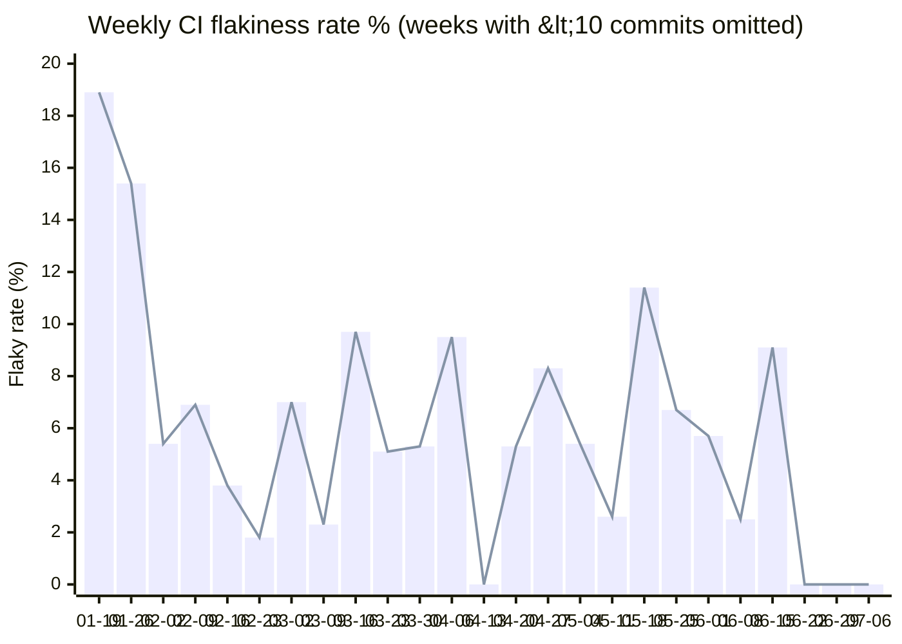

# Flaky Test Baseline Report

Generated: 2026-07-07T22:33:05.674Z | Period: 2026-01-16 to 2026-07-07

## Summary

| Metric | Value |
|--------|-------|
| Total unique commits | 1673 |
| Flaky commits (pass + fail on same SHA) | 103 |
| Flakiness rate | 6.2% |
| Cascade baseline | 1 failures (8 tests) |

## Weekly Trend

| Week | Commits | Flaky | Rate |
|------|---------|-------|------|
| 2026-01-12 | 7 | 1 | 14.3% |
| 2026-01-19 | 37 | 7 | 18.9% |
| 2026-01-26 | 65 | 10 | 15.4% |
| 2026-02-02 | 74 | 4 | 5.4% |
| 2026-02-09 | 72 | 5 | 6.9% |
| 2026-02-15 | 1 | 1 | 100% |
| 2026-02-16 | 79 | 3 | 3.8% |
| 2026-02-23 | 57 | 1 | 1.8% |
| 2026-03-02 | 71 | 5 | 7% |
| 2026-03-08 | 3 | 0 | 0% |
| 2026-03-09 | 44 | 1 | 2.3% |
| 2026-03-16 | 31 | 3 | 9.7% |
| 2026-03-23 | 59 | 3 | 5.1% |
| 2026-03-30 | 38 | 2 | 5.3% |
| 2026-04-06 | 116 | 11 | 9.5% |
| 2026-04-13 | 11 | 0 | 0% |
| 2026-04-20 | 19 | 1 | 5.3% |
| 2026-04-27 | 109 | 9 | 8.3% |
| 2026-05-03 | 9 | 1 | 11.1% |
| 2026-05-04 | 129 | 7 | 5.4% |
| 2026-05-10 | 1 | 0 | 0% |
| 2026-05-11 | 39 | 1 | 2.6% |
| 2026-05-17 | 1 | 0 | 0% |
| 2026-05-18 | 79 | 9 | 11.4% |
| 2026-05-25 | 60 | 4 | 6.7% |
| 2026-06-01 | 106 | 6 | 5.7% |
| 2026-06-07 | 3 | 0 | 0% |
| 2026-06-08 | 80 | 2 | 2.5% |
| 2026-06-15 | 66 | 6 | 9.1% |
| 2026-06-21 | 7 | 0 | 0% |
| 2026-06-22 | 71 | 0 | 0% |
| 2026-06-28 | 3 | 0 | 0% |
| 2026-06-29 | 81 | 0 | 0% |
| 2026-07-05 | 3 | 0 | 0% |
| 2026-07-06 | 42 | 0 | 0% |

## Flaky Test Leaderboard (Non-Cascade)

| File | Failures | Status | Fix PR |
|------|----------|--------|--------|
| `src/modules/transactions/routes/__tests__/controllers/preview-transaction-kiln.transactions.controller.integration.spec.ts` | 20 | Fixed | [#2890](https://github.com/safe-global/safe-client-gateway/pull/2890) |
| `src/modules/transactions/routes/__tests__/controllers/preview-transaction-cow-swap.transactions.controller.integration.spec.ts` | 13 | Fixed | [#2890](https://github.com/safe-global/safe-client-gateway/pull/2890) |
| `src/modules/targeted-messaging/datasources/targeted-messaging.datasource.integration.spec.ts` | 12 | Fixed | [#2891](https://github.com/safe-global/safe-client-gateway/pull/2891) |
| `src/routes/common/guards/rate-limit.guard.spec.ts` | 10 | Fixed | [#3139](https://github.com/safe-global/safe-client-gateway/pull/3139) |
| `src/datasources/job-queue/__tests__/job-queue.service.integration.spec.ts` | 9 | Open | [#2781](https://github.com/safe-global/safe-client-gateway/pull/2781) |
| `src/datasources/cache/redis.cache.service.integration.spec.ts` | 9 | Fixed | [#3136](https://github.com/safe-global/safe-client-gateway/pull/3136) |
| `src/modules/transactions/routes/__tests__/controllers/propose-transaction.transactions.controller.integration.spec.ts` | 8 | Fixed | [#2890](https://github.com/safe-global/safe-client-gateway/pull/2890) |
| `src/modules/notifications/routes/v2/notifications.controller.integration.spec.ts` | 7 | Fixed | [#2890](https://github.com/safe-global/safe-client-gateway/pull/2890) |
| `src/modules/transactions/routes/mappers/common/transaction-data.mapper.spec.ts` | 7 | Open | - |
| `src/modules/safe-shield/recipient-analysis/recipient-analysis.service.spec.ts` | 6 | Fixed | [#2977](https://github.com/safe-global/safe-client-gateway/pull/2977) |
| `src/modules/transactions/routes/helpers/transaction-verifier.helper.spec.ts` | 6 | Fixed | [#2891](https://github.com/safe-global/safe-client-gateway/pull/2891) |
| `src/modules/users/domain/members.repository.integration.spec.ts` | 5 | Fixed | [#2891](https://github.com/safe-global/safe-client-gateway/pull/2891) |
| `src/modules/transactions/routes/__tests__/controllers/add-transaction-confirmations.transactions.controller.integration.spec.ts` | 5 | Fixed | [#2890](https://github.com/safe-global/safe-client-gateway/pull/2890) |
| `src/domain/common/entities/safe-signature.spec.ts` | 4 | Fixed | [#3136](https://github.com/safe-global/safe-client-gateway/pull/3136) |
| `src/modules/users/domain/users.repository.integration.spec.ts` | 3 | Open | - |
| `src/modules/transactions/routes/__tests__/controllers/get-transaction-by-id.transactions.controller.integration.spec.ts` | 2 | Fixed | [#2890](https://github.com/safe-global/safe-client-gateway/pull/2890) |
| `src/modules/users/domain/__tests__/user-identity-resolver.service.spec.ts` | 2 | Open | - |

## Cascade Tests

These 8 tests all failed exactly 1 times, suggesting they fail together as a cascade (e.g., shared infrastructure issue).

Click to expand cascade test list

- `src/modules/transactions/routes/__tests__/controllers/preview-transaction-cow-swap.transactions.controller.spec.ts`
- `src/modules/transactions/routes/__tests__/controllers/preview-transaction-kiln.transactions.controller.spec.ts`
- `src/modules/safe-shield/safe-shield.controller.integration.spec.ts`
- `src/modules/safe-apps/routes/safe-apps.controller.integration.spec.ts`
- `src/modules/bridge/domain/entities/bridge-name.entity.spec.ts`
- `src/modules/auth/routes/auth.controller.integration.spec.ts`
- `src/modules/transactions/routes/__tests__/controllers/preview-transaction.transactions.controller.integration.spec.ts`
- `src/modules/messages/domain/helpers/message-verifier.helper.spec.ts`

## Fix PRs

### [#3139](https://github.com/safe-global/safe-client-gateway/pull/3139) - chore(tests): reduce CI flakiness (clearMocks + seeded faker) (Merged)

- `src/datasources/job-queue/__tests__/job-queue.service.integration.spec.ts`
- `src/routes/common/guards/rate-limit.guard.spec.ts`

### [#3136](https://github.com/safe-global/safe-client-gateway/pull/3136) - feat: replace Jest with Vitest (Merged)

- `scripts/env-json-helpers.spec.ts`
- `scripts/generate-env.spec.ts`
- `scripts/validate-env-json.spec.ts`
- `src/__tests__/matchers/to-be-string-or-null.spec.ts`
- `src/__tests__/timezone.spec.ts`
- `src/config/nest.configuration.service.spec.ts`
- `src/datasources/cache/__tests__/fake.cache.service.spec.ts`
- `src/datasources/cache/cache.first.data.source.spec.ts`
- `src/datasources/cache/redis.cache.service.integration.spec.ts`
- `src/datasources/cache/redis.cache.service.key-prefix.spec.ts`
- `src/datasources/circuit-breaker/circuit-breaker.service.spec.ts`
- `src/datasources/config-api/config-api.service.spec.ts`
- `src/datasources/db/v1/cached-query-resolver.spec.ts`
- `src/datasources/db/v1/postgres-database.migration.hook.integration.spec.ts`
- `src/datasources/db/v1/postgres-database.migrator.integration.spec.ts`
- `src/datasources/db/v2/database-migrator.service.integration.spec.ts`
- `src/datasources/db/v2/postgres-database.service.integration.spec.ts`
- `src/datasources/fee-service-api/fee-service-api.service.spec.ts`
- `src/datasources/job-queue/__tests__/test.job.consumer.spec.ts`
- `src/datasources/job-queue/job-queue.service.spec.ts`
- `src/datasources/jwt/jwt.service.spec.ts`
- `src/datasources/locking-api/fingerprint-api.service.spec.ts`
- `src/datasources/locking-api/locking-api.service.spec.ts`
- `src/datasources/network/auth/tx-auth-headers.helper.spec.ts`
- `src/datasources/network/fetch.network.service.spec.ts`
- `src/datasources/network/network.module.integration.spec.ts`
- `src/datasources/push-notifications-api/firebase-cloud-messaging-api.service.spec.ts`
- `src/datasources/storage/aws-cloud-storage-api.service.spec.ts`
- `src/domain/common/entities/safe-signature.spec.ts`
- `src/logging/__tests__/logger-factory.spec.ts`
- `src/logging/logging.service.spec.ts`
- `src/modules/alerts/datasources/tenderly-api.service.spec.ts`
- `src/modules/alerts/domain/contracts/decoders/__tests__/delay-modifier-decoder.helper.spec.ts`
- `src/modules/alerts/routes/alerts.controller.integration.spec.ts`
- `src/modules/auth/oidc/auth0/datasources/auth0-api.service.spec.ts`
- `src/modules/auth/oidc/auth0/domain/auth0-token.verifier.spec.ts`
- `src/modules/auth/oidc/auth0/domain/auth0.repository.spec.ts`
- `src/modules/auth/oidc/routes/guards/oidc-auth-rate-limit.guard.spec.ts`
- `src/modules/auth/oidc/routes/oidc-auth.controller.integration.spec.ts`
- `src/modules/auth/oidc/routes/oidc-auth.service.spec.ts`
- `src/modules/auth/routes/auth.controller.integration.spec.ts`
- `src/modules/auth/routes/auth.service.spec.ts`
- `src/modules/auth/routes/decorators/auth.decorator.integration.spec.ts`
- `src/modules/auth/routes/guards/auth.guard.integration.spec.ts`
- `src/modules/auth/routes/guards/optional-auth.guard.integration.spec.ts`
- `src/modules/balances/datasources/balances-api.manager.spec.ts`
- `src/modules/balances/datasources/coingecko-api.service.spec.ts`
- `src/modules/balances/datasources/zerion-balances-api.service.spec.ts`
- `src/modules/balances/routes/__tests__/controllers/zerion-balances.controller.integration.spec.ts`
- `src/modules/balances/routes/balances.controller.integration.spec.ts`
- `src/modules/blockchain/datasources/blockchain-api.manager.spec.ts`
- `src/modules/bridge/datasources/lifi-api.service.spec.ts`
- `src/modules/chains/domain/chains.repository.spec.ts`
- `src/modules/chains/feature-flags/feature-flag.service.integration.spec.ts`
- `src/modules/chains/feature-flags/feature-flag.service.spec.ts`
- `src/modules/chains/routes/chains.controller.integration.spec.ts`
- `src/modules/chains/routes/v2/chains.v2.controller.integration.spec.ts`
- `src/modules/chains/routes/v2/chains.v2.service.spec.ts`
- `src/modules/collectibles/routes/__tests__/controllers/zerion-collectibles.controller.integration.spec.ts`
- `src/modules/collectibles/routes/collectibles.controller.integration.spec.ts`
- `src/modules/community/routes/community.controller.integration.spec.ts`
- `src/modules/contracts/domain/contracts.repository.spec.ts`
- `src/modules/contracts/domain/decoders/__tests__/multi-send-decoder.helper.spec.ts`
- `src/modules/contracts/domain/decoders/__tests__/safe-decoder.helper.spec.ts`
- `src/modules/contracts/routes/contracts.controller.integration.spec.ts`
- `src/modules/contracts/routes/mappers/contract.mapper.spec.ts`
- `src/modules/counterfactual-safes/domain/counterfactual-safes.repository.integration.spec.ts`
- `src/modules/csv-export/v1/consumers/csv-export.consumer.spec.ts`
- `src/modules/csv-export/v1/csv-export.service.spec.ts`
- `src/modules/csv-export/v1/datasources/export-api.manager.spec.ts`
- `src/modules/csv-export/v1/datasources/export-api.service.spec.ts`
- `src/modules/data-decoder/datasources/data-decoder-api.service.spec.ts`
- `src/modules/delegate/routes/delegates.controller.integration.spec.ts`

### [#3162](https://github.com/safe-global/safe-client-gateway/pull/3162) - chore: Fix flaky unit test (Merged)

- `src/modules/auth/utils/auth-redirect.helper.spec.ts`

### [#3014](https://github.com/safe-global/safe-client-gateway/pull/3014) - fix: add missing app.close() teardown in integration tests (Merged)

- `src/modules/chains/routes/chains.controller.integration.spec.ts`
- `src/modules/delegate/routes/delegates.controller.integration.spec.ts`
- `src/modules/delegate/routes/v2/delegates.v2.controller.integration.spec.ts`
- `src/modules/messages/routes/messages.controller.integration.spec.ts`
- `src/modules/notifications/routes/v1/notifications.controller.integration.spec.ts`
- `src/modules/root/routes/root.controller.integration.spec.ts`
- `src/modules/safe/routes/safes.controller.nonces.integration.spec.ts`
- `src/routes/common/decorators/pagination.data.decorator.integration.spec.ts`
- `src/routes/common/interceptors/cache-control.interceptor.integration.spec.ts`

### [#2992](https://github.com/safe-global/safe-client-gateway/pull/2992) - fix: allow subdomains for redirect url to test previews (Merged)

- `src/modules/auth/oidc/routes/oidc-auth.controller.integration.spec.ts`
- `src/modules/auth/oidc/routes/oidc-auth.service.spec.ts`

### [#2977](https://github.com/safe-global/safe-client-gateway/pull/2977) - fix(tests): resolve flaky tests from chain ID collisions and missing mock resets (Merged)

- `src/modules/safe-shield/recipient-analysis/recipient-analysis.service.spec.ts`
- `src/modules/transactions/routes/__tests__/controllers/preview-transaction-cow-swap.transactions.controller.integration.spec.ts`

### [#2944](https://github.com/safe-global/safe-client-gateway/pull/2944) - feat(auth): mock external auth provider (Open)

- `src/modules/auth/datasources/__tests__/external-auth.mock.datasource.spec.ts`
- `src/modules/auth/routes/__tests__/mock-consent.controller.spec.ts`

### [#2911](https://github.com/safe-global/safe-client-gateway/pull/2911) - refactor: proper test clean-up (Merged)

- `src/datasources/db/v2/postgres-database.service.integration.spec.ts`
- `src/datasources/network/network.module.integration.spec.ts`
- `src/modules/alerts/routes/alerts.controller.integration.spec.ts`
- `src/modules/balances/routes/__tests__/controllers/zerion-balances.controller.integration.spec.ts`
- `src/modules/balances/routes/balances.controller.integration.spec.ts`
- `src/modules/collectibles/routes/__tests__/controllers/zerion-collectibles.controller.integration.spec.ts`
- `src/modules/collectibles/routes/collectibles.controller.integration.spec.ts`
- `src/modules/community/routes/community.controller.integration.spec.ts`
- `src/modules/contracts/routes/contracts.controller.integration.spec.ts`
- `src/modules/estimations/routes/estimations.controller.integration.spec.ts`
- `src/modules/hooks/routes/hooks-cache.integration.spec.ts`
- `src/modules/hooks/routes/hooks-notifications.integration.spec.ts`
- `src/modules/hooks/routes/hooks.controller.integration.spec.ts`
- `src/modules/notifications/routes/v2/notifications.controller.integration.spec.ts`
- `src/modules/owners/routes/owners.controller.v1.integration.spec.ts`
- `src/modules/owners/routes/owners.controller.v2.integration.spec.ts`
- `src/modules/owners/routes/owners.controller.v3.integration.spec.ts`
- `src/modules/relay/routes/relay.controller.integration.spec.ts`
- `src/modules/safe-apps/routes/safe-apps.controller.integration.spec.ts`
- `src/modules/safe-shield/safe-shield.controller.integration.spec.ts`
- `src/modules/safe/routes/safes.controller.integration.spec.ts`
- `src/modules/safe/routes/safes.controller.overview.integration.spec.ts`
- `src/modules/safe/routes/v2/__tests__/safes.v2.controller.overview.integration.spec.ts`
- `src/modules/transactions/routes/__tests__/controllers/add-transaction-confirmations.transactions.controller.integration.spec.ts`
- `src/modules/transactions/routes/__tests__/controllers/delete-transaction.transactions.controller.integration.spec.ts`
- `src/modules/transactions/routes/__tests__/controllers/get-creation-transaction.transactions.controller.integration.spec.ts`
- `src/modules/transactions/routes/__tests__/controllers/get-transaction-by-id.transactions.controller.integration.spec.ts`
- `src/modules/transactions/routes/__tests__/controllers/list-incoming-transfers-by-safe.transactions.controller.integration.spec.ts`
- `src/modules/transactions/routes/__tests__/controllers/list-module-transactions-by-safe.transactions.controller.integration.spec.ts`
- `src/modules/transactions/routes/__tests__/controllers/list-multisig-transactions-by-safe.transactions.controller.integration.spec.ts`
- `src/modules/transactions/routes/__tests__/controllers/list-queued-transactions-by-safe.transactions.controller.integration.spec.ts`
- `src/modules/transactions/routes/__tests__/controllers/preview-transaction.transactions.controller.integration.spec.ts`
- `src/modules/transactions/routes/__tests__/controllers/propose-transaction.transactions.controller.integration.spec.ts`
- `src/modules/transactions/routes/transactions-history.controller.integration.spec.ts`
- `src/modules/transactions/routes/transactions-history.imitation-transactions.controller.integration.spec.ts`
- `src/routes/common/filters/global-error.filter.integration.spec.ts`

### [#2913](https://github.com/safe-global/safe-client-gateway/pull/2913) - refactor: use TestBlocklistModule for testing (Merged)

- `src/modules/messages/domain/helpers/message-verifier.helper.spec.ts`
- `src/modules/messages/routes/messages.controller.integration.spec.ts`
- `src/modules/transactions/routes/__tests__/controllers/add-transaction-confirmations.transactions.controller.integration.spec.ts`
- `src/modules/transactions/routes/__tests__/controllers/get-transaction-by-id.transactions.controller.integration.spec.ts`
- `src/modules/transactions/routes/__tests__/controllers/list-queued-transactions-by-safe.transactions.controller.integration.spec.ts`
- `src/modules/transactions/routes/__tests__/controllers/propose-transaction.transactions.controller.integration.spec.ts`
- `src/modules/transactions/routes/helpers/transaction-verifier.helper.spec.ts`

### [#2907](https://github.com/safe-global/safe-client-gateway/pull/2907) - fix: Preview transaction - Kiln flaky test (Merged)

- `src/modules/transactions/routes/__tests__/controllers/preview-transaction-kiln.transactions.controller.integration.spec.ts`

### [#2903](https://github.com/safe-global/safe-client-gateway/pull/2903) - fix: integration tests (part 2) (Merged)

- `src/modules/notifications/routes/v2/notifications.controller.integration.spec.ts`

### [#2891](https://github.com/safe-global/safe-client-gateway/pull/2891) - chore: fix flaky tests (Merged)

- `src/modules/spaces/domain/space-safes.repository.integration.spec.ts`
- `src/modules/spaces/domain/spaces.repository.integration.spec.ts`
- `src/modules/targeted-messaging/datasources/targeted-messaging.datasource.integration.spec.ts`
- `src/modules/transactions/routes/helpers/transaction-verifier.helper.spec.ts`
- `src/modules/users/domain/members.repository.integration.spec.ts`

### [#2890](https://github.com/safe-global/safe-client-gateway/pull/2890) - chore: separate unit from integration tests (Merged)

- `src/config/configuration.module.spec.ts`
- `src/datasources/db/v2/database-migrator.service.integration.spec.ts`
- `src/datasources/network/network.module.integration.spec.ts`
- `src/modules/alerts/routes/alerts.controller.integration.spec.ts`
- `src/modules/auth/routes/auth.controller.integration.spec.ts`
- `src/modules/auth/routes/decorators/auth.decorator.integration.spec.ts`
- `src/modules/auth/routes/guards/auth.guard.integration.spec.ts`
- `src/modules/auth/routes/guards/optional-auth.guard.integration.spec.ts`
- `src/modules/balances/routes/__tests__/controllers/zerion-balances.controller.integration.spec.ts`
- `src/modules/balances/routes/balances.controller.integration.spec.ts`
- `src/modules/bridge/datasources/lifi-api.service.spec.ts`
- `src/modules/chains/routes/chains.controller.integration.spec.ts`
- `src/modules/collectibles/routes/__tests__/controllers/zerion-collectibles.controller.integration.spec.ts`
- `src/modules/collectibles/routes/collectibles.controller.integration.spec.ts`
- `src/modules/community/routes/community.controller.integration.spec.ts`
- `src/modules/contracts/routes/contracts.controller.integration.spec.ts`
- `src/modules/delegate/routes/delegates.controller.integration.spec.ts`
- `src/modules/delegate/routes/v2/delegates.v2.controller.integration.spec.ts`
- `src/modules/estimations/routes/estimations.controller.integration.spec.ts`
- `src/modules/health/routes/health.controller.integration.spec.ts`
- `src/modules/hooks/routes/hooks-cache.integration.spec.ts`
- `src/modules/hooks/routes/hooks-notifications.integration.spec.ts`
- `src/modules/hooks/routes/hooks.controller.integration.spec.ts`
- `src/modules/hooks/routes/hooks.controller.spec.ts`
- `src/modules/hooks/routes/hooks.http.controller.spec.ts`
- `src/modules/messages/routes/messages.controller.integration.spec.ts`
- `src/modules/notifications/routes/v1/notifications.controller.integration.spec.ts`
- `src/modules/notifications/routes/v2/notifications.controller.integration.spec.ts`
- `src/modules/portfolio/v1/portfolio.controller.spec.ts`
- `src/modules/positions/routes/positions.controller.spec.ts`
- `src/modules/recovery/routes/recovery.controller.integration.spec.ts`
- `src/modules/relay/routes/relay.controller.integration.spec.ts`
- `src/modules/root/routes/root.controller.integration.spec.ts`
- `src/modules/safe-apps/routes/safe-apps.controller.integration.spec.ts`
- `src/modules/safe-shield/safe-shield.controller.integration.spec.ts`
- `src/modules/safe/routes/safes.controller.integration.spec.ts`
- `src/modules/safe/routes/safes.controller.nonces.integration.spec.ts`
- `src/modules/safe/routes/safes.controller.overview.integration.spec.ts`
- `src/modules/safe/routes/v2/__tests__/safes.v2.controller.overview.integration.spec.ts`
- `src/modules/targeted-messaging/routes/targeted-messaging.controller.integration.spec.ts`
- `src/modules/transactions/routes/__tests__/controllers/add-transaction-confirmations.transactions.controller.integration.spec.ts`
- `src/modules/transactions/routes/__tests__/controllers/delete-transaction.transactions.controller.integration.spec.ts`
- `src/modules/transactions/routes/__tests__/controllers/get-creation-transaction.transactions.controller.integration.spec.ts`
- `src/modules/transactions/routes/__tests__/controllers/get-transaction-by-id.transactions.controller.integration.spec.ts`
- `src/modules/transactions/routes/__tests__/controllers/list-incoming-transfers-by-safe.transactions.controller.integration.spec.ts`
- `src/modules/transactions/routes/__tests__/controllers/list-module-transactions-by-safe.transactions.controller.integration.spec.ts`
- `src/modules/transactions/routes/__tests__/controllers/list-multisig-transactions-by-safe.transactions.controller.integration.spec.ts`
- `src/modules/transactions/routes/__tests__/controllers/list-queued-transactions-by-safe.transactions.controller.integration.spec.ts`
- `src/modules/transactions/routes/__tests__/controllers/preview-transaction-cow-swap.transactions.controller.integration.spec.ts`
- `src/modules/transactions/routes/__tests__/controllers/preview-transaction-kiln.transactions.controller.integration.spec.ts`
- `src/modules/transactions/routes/__tests__/controllers/preview-transaction.transactions.controller.integration.spec.ts`
- `src/modules/transactions/routes/__tests__/controllers/propose-transaction.transactions.controller.integration.spec.ts`
- `src/modules/transactions/routes/transactions-history.controller.integration.spec.ts`
- `src/modules/transactions/routes/transactions-history.imitation-transactions.controller.integration.spec.ts`
- `src/routes/common/decorators/pagination.data.decorator.integration.spec.ts`
- `src/routes/common/filters/global-error.filter.integration.spec.ts`
- `src/routes/common/filters/zod-error.filter.integration.spec.ts`
- `src/routes/common/interceptors/cache-control.interceptor.integration.spec.ts`
- `src/routes/common/interceptors/route-logger.interceptor.integration.spec.ts`

### [#2846](https://github.com/safe-global/safe-client-gateway/pull/2846) - tests: fix race condition in tests (Merged)

- `src/modules/transactions/routes/transactions-history.imitation-transactions.controller.spec.ts`

### [#2842](https://github.com/safe-global/safe-client-gateway/pull/2842) - Verify tests pass on feat/zerion-cache-per-address branch (Open)

- `src/modules/safe-shield/safe-shield.controller.integration.spec.ts`
- `src/modules/safe-shield/threat-analysis/blockaid/blockaid-api.service.spec.ts`
- `src/modules/safe-shield/threat-analysis/blockaid/schemas/blockaid-scan-response.schema.spec.ts`
- `src/modules/safe-shield/threat-analysis/threat-analysis.service.spec.ts`

### [#2737](https://github.com/safe-global/safe-client-gateway/pull/2737) - fix: eliminate test flakiness across test suite (Open)

- `src/datasources/blockchain/blockchain-api.manager.spec.ts`
- `src/datasources/job-queue/__tests__/job-queue.service.integration.spec.ts`
- `src/datasources/jwt/__tests__/jwt-claims.entity.schema.spec.ts`
- `src/domain/common/utils/__tests__/number.spec.ts`
- `src/domain/notifications/v2/notifications.repository.integration.spec.ts`
- `src/domain/spaces/address-books/address-book-items.repository.integration.spec.ts`
- `src/domain/spaces/space-safes.repository.spec.ts`
- `src/domain/spaces/spaces.repository.integration.spec.ts`
- `src/domain/users/members.repository.integration.spec.ts`
- `src/domain/users/users.repository.integration.spec.ts`
- `src/domain/wallets/wallets.repository.integration.spec.ts`
- `src/logging/__tests__/logger-factory.spec.ts`
- `src/modules/csv-export/csv-utils/csv.service.spec.ts`
- `src/modules/csv-export/v1/csv-export.service.spec.ts`
- `src/routes/alerts/alerts.controller.spec.ts`
- `src/routes/auth/auth.controller.spec.ts`
- `src/routes/users/users.controller.spec.ts`

### [#2806](https://github.com/safe-global/safe-client-gateway/pull/2806) - feat(portfolio): add X-Env testnet header for Zerion API requests (Merged)

- `src/modules/balances/datasources/zerion-api.helpers.spec.ts`
- `src/modules/balances/datasources/zerion-balances-api.service.spec.ts`
- `src/modules/balances/routes/__tests__/controllers/zerion-balances.controller.spec.ts`
- `src/modules/collectibles/routes/__tests__/controllers/zerion-collectibles.controller.spec.ts`
- `src/modules/portfolio/v1/portfolio.service.spec.ts`

### [#2781](https://github.com/safe-global/safe-client-gateway/pull/2781) - chores(tests): address flaky tests (Open)

- `src/datasources/job-queue/__tests__/job-queue.service.integration.spec.ts`
- `src/domain/spaces/spaces.repository.integration.spec.ts`
- `src/domain/users/members.repository.integration.spec.ts`
- `src/domain/users/users.repository.integration.spec.ts`
- `src/routes/relay/relay.controller.spec.ts`
- `src/routes/safes/safes.controller.overview.spec.ts`
- `src/routes/spaces/space-safes.controller.spec.ts`
- `src/routes/transactions/__tests__/controllers/preview-transaction-cow-swap.transactions.controller.spec.ts`

## Still-Open Flaky Tests

- `src/datasources/job-queue/__tests__/job-queue.service.integration.spec.ts` (9 failures)
- `src/modules/transactions/routes/mappers/common/transaction-data.mapper.spec.ts` (7 failures)
- `src/modules/users/domain/users.repository.integration.spec.ts` (3 failures)
- `src/modules/users/domain/__tests__/user-identity-resolver.service.spec.ts` (2 failures)

---

*This report was auto-generated by `scripts/analyze-flaky-tests.ts`. It will be superseded by Datadog Test Optimization (WA-1754).*
